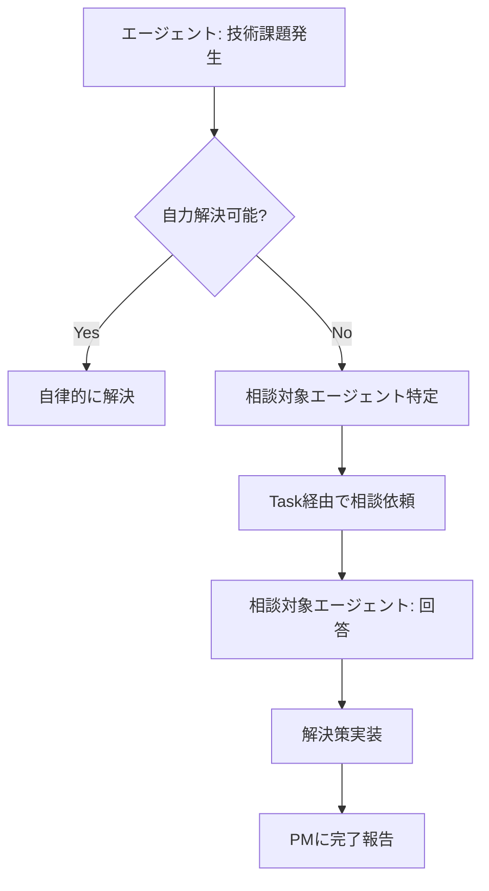
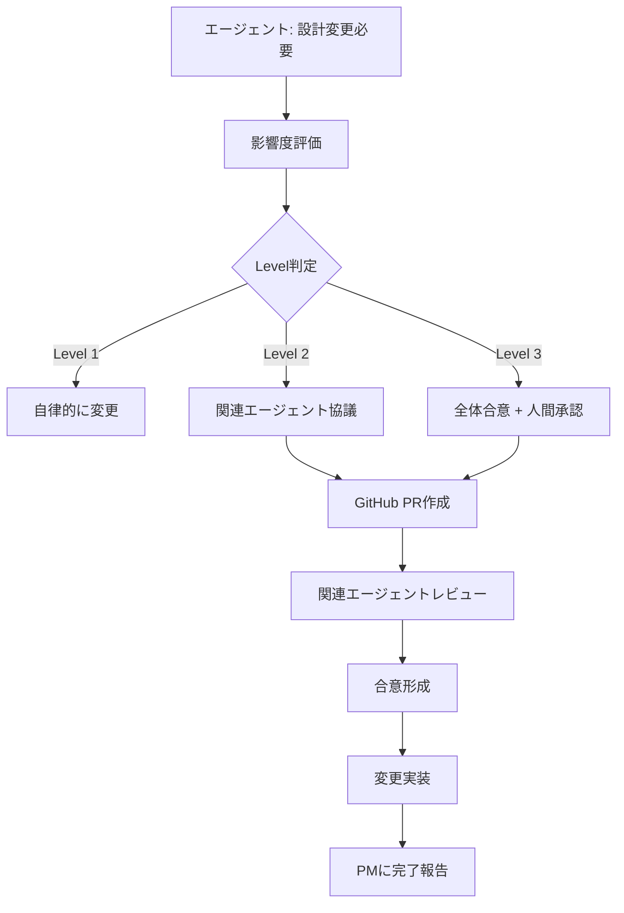

# エージェント協調プロトコル

## Cinecom プロジェクト - Claude Code協調システム

### 概要

本ドキュメントは、Cinecomプロジェクトにおけるエージェント間の協調プロトコルを定義します。Claude CodeのTodoWrite + Taskツールを基盤とした効率的な協調システムの運用方法を詳述します。

### 協調システムの基本構造

#### **プロジェクトマネージャー（PM）**

- **役割**: 全体調整・進捗管理・Task分散
- **ツール**: TodoWrite（進捗管理）+ Task（エージェント起動）
- **責任範囲**: 全フェーズの統括・品質管理・人間承認プロセス

#### **専門エージェント**

- **役割**: 専門分野での具体的作業実行
- **起動方法**: PMからのTaskツール指示
- **完了報告**: 作業結果をPMに返却
- **連携**: 必要時に他エージェントとの協調

### エージェント間連携プロトコル

#### **1. 連携が必要な状況**

**Level 1 - 自律判断範囲内**:

- 専門分野内の技術的判断
- ベストプラクティスの適用
- パフォーマンス最適化
→ **連携不要**: 各エージェントが自律的に判断

**Level 2 - 関連エージェント協議必要**:

- API仕様変更
- データベーススキーマ変更
- UI/UX仕様変更
- マイクロサービス間インターフェース変更
→ **連携必要**: 影響を受けるエージェントとの事前協議

**Level 3 - 全体合意 + 人間承認**:

- 技術スタック変更
- アーキテクチャ根本変更
- プロジェクトスコープ変更
→ **全エージェント連携 + 人間承認**: 包括的な影響評価と合意形成

#### **2. 連携トリガー条件**

**自動トリガー**:

```yaml
技術的ブロッカー:
  条件: 24時間以上解決できない技術課題
  アクション: PMに自動エスカレーション
  連携対象: 関連する専門エージェント

設計変更:
  条件: Level 2以上の仕様変更
  アクション: 影響分析 + 関連エージェント通知
  連携対象: CODEOWNERS設定に基づく自動特定

依存関係ブロック:
  条件: 他エージェントの成果物待ち
  アクション: 依存先エージェントに進捗確認
  連携対象: 依存関係マトリックスで特定
```

**手動トリガー**:

```yaml
技術相談:
  条件: 専門外の技術判断が必要
  アクション: Task経由での相談依頼
  連携対象: 該当専門分野のエージェント

品質確認:
  条件: クロスチェックが必要な成果物
  アクション: GitHub PR経由でのレビュー依頼
  連携対象: レビュー対象に応じた専門エージェント
```

#### **3. 連携実装方法**

**Task経由での連携**:

```yaml
# 技術相談の例
Task(
  subagent_type="backend",
  description="API設計相談",
  prompt="シーンサービスとムービーサービス間のAPI連携について、パフォーマンスと設計の観点から最適なアプローチを教えてください。現在の検討案: [具体的な案を記載]"
)

# 設計レビュー依頼の例  
Task(
  subagent_type="database",
  description="データベース設計レビュー",
  prompt="マイクロサービス間のデータ整合性確保について、添付のER図とAPI仕様をレビューし、改善提案をお願いします。"
)
```

**GitHub経由での連携**:

```yaml
Issue作成:
  目的: 技術的質問・相談・課題共有
  タイトル: "[相談] シーンデータの正規化レベルについて (@database-agent)"
  内容: 具体的な相談内容 + 背景情報
  ラベル: "consultation", "database", "architecture"

PR作成:
  目的: 設計変更・実装レビュー
  レビュアー: CODEOWNERS設定による自動アサイン
  内容: 変更内容 + 影響範囲 + レビューポイント
```

#### **4. 依存関係マトリックス**

```yaml
要件定義エージェント:
  影響を与える対象:
    - アーキテクトエージェント: システム設計の前提条件
    - UX/UIエージェント: ユーザー体験設計の要件
    - データベースエージェント: データ要件の明確化
    - テストエージェント: テスト要件の定義
  
  連携が必要な場面:
    - 要件変更時: 全関連エージェントに影響通知
    - 機能追加時: 実装可能性の技術相談
    - 優先順位変更時: リソース配分の調整

アーキテクトエージェント:
  影響を与える対象:
    - データベースエージェント: データ構造設計の制約
    - バックエンドエージェント: 技術スタック・API設計
    - フロントエンドエージェント: システム境界・連携方法
    - DevOpsエージェント: インフラ要件・デプロイ戦略
  
  連携が必要な場面:
    - 技術スタック変更時: 全開発エージェントへの影響確認
    - API仕様策定時: フロントエンド・バックエンドとの協議
    - セキュリティ要件確定時: セキュリティエージェントとの協調

データベースエージェント:
  影響を与える対象:
    - バックエンドエージェント: ORM・マイグレーション設計
    - テストエージェント: データ整合性テスト要件
    - DevOpsエージェント: データベース運用・バックアップ戦略
  
  連携が必要な場面:
    - スキーマ変更時: バックエンドエージェントとの整合性確認
    - パフォーマンス課題時: アーキテクトとの最適化協議
    - データ移行時: DevOpsエージェントとの作業調整

バックエンドエージェント:
  影響を与える対象:
    - フロントエンドエージェント: API仕様・レスポンス形式
    - テストエージェント: APIテスト仕様
    - セキュリティエージェント: 認証・認可実装
    - DevOpsエージェント: デプロイ・監視要件
  
  連携が必要な場面:
    - API変更時: フロントエンドエージェントとの事前協議
    - パフォーマンス問題時: データベース・アーキテクトとの協調
    - セキュリティ実装時: セキュリティエージェントとの技術相談

フロントエンドエージェント:
  影響を与える対象:
    - UX/UIエージェント: デザイン実装の技術制約
    - テストエージェント: UIテスト・E2Eテスト要件
    - DevOpsエージェント: フロントエンドビルド・デプロイ
  
  連携が必要な場面:
    - UI実装困難時: UX/UIエージェントとの代替案検討
    - API統合問題時: バックエンドエージェントとの調整
    - パフォーマンス問題時: アーキテクトとの最適化相談
```

#### **5. 連携フロー**

**技術相談フロー**:



**設計変更フロー**:



#### **6. 連携テンプレート**

**技術相談テンプレート**:

```markdown
## 技術相談依頼

**相談者**: [エージェント名]
**相談対象**: [対象エージェント名]
**緊急度**: [High/Medium/Low]

### 背景・状況
[現在の状況・課題の背景を説明]

### 具体的な相談内容
[技術的な課題・判断が必要な事項]

### 検討済みの選択肢
1. [選択肢1]: [メリット・デメリット]
2. [選択肢2]: [メリット・デメリット]

### 期待する回答
[どのような回答・アドバイスを求めているか]

### 関連資料
- [設計書・仕様書・コード等のリンク]
```

**設計変更提案テンプレート**:

```markdown
## 設計変更提案

**提案者**: [エージェント名]
**影響度**: [Level 1/2/3]
**対象領域**: [API/Database/UI/Architecture/etc]

### 変更理由
[なぜ変更が必要なのか]

### 変更内容
**変更前**:
[現在の設計・実装]

**変更後**:
[提案する新しい設計・実装]

### 影響範囲
**影響を受けるサービス**:
- [ ] user-service: [具体的な影響]
- [ ] movie-service: [具体的な影響]
- [ ] actor-service: [具体的な影響]
- [ ] scene-service: [具体的な影響]
- [ ] review-service: [具体的な影響]
- [ ] frontend: [具体的な影響]

**影響を受けるエージェント**:
- [ ] @アーキテクトエージェント: [理由]
- [ ] @データベースエージェント: [理由]
- [ ] @バックエンドエージェント: [理由]
- [ ] @フロントエンドエージェント: [理由]

### 実装計画
1. [実装ステップ1]
2. [実装ステップ2]
3. [実装ステップ3]

### レビュー期限
[期限日時]
```

#### **7. 緊急時連携プロトコル**

**システム障害時**:

```yaml
重大障害 (Critical):
  対応時間: 即座（30分以内）
  連携方法: 
    - PMに緊急Task発行
    - Discord #cinecom-urgent通知
    - GitHub緊急Issue作成
  連携対象: 関連する全エージェント
  
軽微障害 (High):
  対応時間: 4時間以内
  連携方法:
    - PMに通常Task発行
    - Discord #cinecom-general通知
  連携対象: 直接関連するエージェント

パフォーマンス問題 (Medium):
  対応時間: 24時間以内
  連携方法:
    - GitHub Issue作成
    - 週次レビューで検討
  連携対象: パフォーマンス担当エージェント
```

**ブロッカー発生時**:

```yaml
依存待ち:
  アクション: 依存先エージェントに進捗確認Task
  エスカレーション: 48時間で自動的にPMに報告
  
技術的行き詰まり:
  アクション: 関連エージェントに技術相談Task
  エスカレーション: 24時間で人間承認プロセス起動
  
要件不明確:
  アクション: 要件定義エージェントに明確化Task
  エスカレーション: 12時間でPMと人間レビュアーに通知
```

#### **8. 連携品質管理**

**連携効率メトリクス**:

```yaml
応答時間:
  技術相談: 平均4時間以内
  設計レビュー: 平均24時間以内
  緊急事項: 平均30分以内

解決率:
  一次回答での解決: 80%以上
  追加協議での解決: 95%以上
  エスカレーション率: 5%以下

連携満足度:
  相談内容の適切性: 90%以上
  回答の有用性: 90%以上
  レスポンス速度: 85%以上
```

**連携改善プロセス**:

```yaml
週次振り返り:
  - 連携が発生した事例の分析
  - ボトルネック・改善点の特定
  - プロトコルの調整・最適化

月次評価:
  - 連携効率メトリクスの評価
  - エージェント間の連携パターン分析
  - 成功事例・ベストプラクティスの共有

四半期見直し:
  - 連携プロトコル全体の見直し
  - 新しい連携パターンの追加
  - 廃止すべき非効率プロセスの特定
```

### 関連ドキュメント

- **プロジェクト憲章**: `/docs/project/charter.md` - プロジェクト全体概要
- **エージェント責任範囲**: `/docs/agents/agent_responsibilities.md` - 各エージェントの詳細役割
- **GitHub運用ガイド**: `/docs/development/git_workflow.md` - PR・Issue運用方法
- **Discord統合設定**: `/docs/agents/discord_integration.md` - 通知システム設定
- **緊急時対応手順**: `/docs/agents/emergency_procedures.md` - 障害・問題発生時の対応

### 更新履歴

- **v1.0** (2025-08-22): 初版作成 - 基本的な連携プロトコル定義
- **次回更新予定**: Phase 1完了時（Week 2終了時）- 実運用結果による調整

---

**注意**: 本プロトコルはプロジェクト進行中に最適化・調整されます。実際の運用で発見された改善点は速やかに反映し、全エージェントに共有します。
