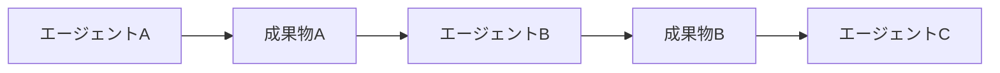
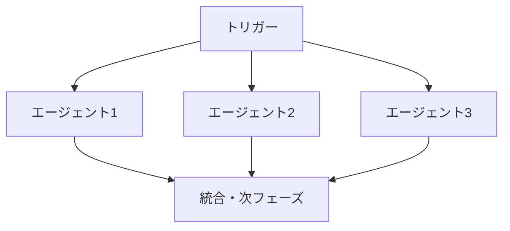
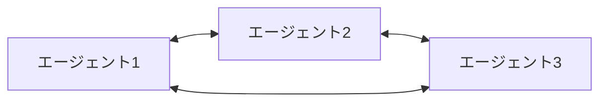

# エージェント間連携プロトコル（詳細版）

## 概要

Taskツール標準化に基づく、エージェント間の詳細な連携プロトコルと具体的な実装方法を定義します。

## 1. 基本連携パターン

### パターンA: 順次実行（Sequential Execution）



**実装例**：

```python
# Step 1: 要求分析
requirements_result = Task(
    subagent_type="requirements_analysis",
    description="要求分析実行",
    prompt=get_standard_prompt("requirements_analysis", {
        "input_charter": "docs/project/charter.md",
        "output_analysis": "docs/project/requirements_analysis.md"
    })
)

# Step 2: 要件定義（要求分析完了後）
requirements_definition = Task(
    subagent_type="requirements_definition",
    description="要件定義作成",
    prompt=get_standard_prompt("requirements_definition", {
        "input_analysis": requirements_result.output_path,
        "output_requirements": "docs/project/requirements.md"
    })
)
```

### パターンB: 並列実行（Parallel Execution）



**実装例**：

```python
# 並列技術調査タスク
parallel_research = [
    Task(
        subagent_type="architect",
        description="技術スタック調査",
        prompt=get_standard_prompt("architect", {"task_type": "tech_research"})
    ),
    Task(
        subagent_type="database",
        description="DB技術調査",
        prompt=get_standard_prompt("database", {"task_type": "tech_research"})
    ),
    Task(
        subagent_type="devops",
        description="インフラ技術調査",
        prompt=get_standard_prompt("devops", {"task_type": "tech_research"})
    )
]

# プロジェクトマネージャーが並列実行を管理
execute_parallel_tasks(parallel_research)
```

### パターンC: 協調実行（Collaborative Execution）



**実装例**：

```python
# API設計における協調作業
api_design_collaboration = {
    "architect": Task(
        subagent_type="architect",
        description="API仕様骨組み設計",
        prompt="システム設計に基づいてRESTful API基本構造を設計し、バックエンドエージェントと協調して詳細仕様を決定してください。"
    ),
    "backend": Task(
        subagent_type="backend",
        description="API実装仕様協議",
        prompt="アーキテクトエージェントの基本設計に基づいて、実装観点から最適なAPI仕様を協議し、具体的なエンドポイント定義を作成してください。"
    ),
    "frontend": Task(
        subagent_type="frontend",
        description="API利用側観点レビュー",
        prompt="API仕様をフロントエンド利用観点からレビューし、使いやすさ・効率性の改善提案を行ってください。"
    )
}
```

## 2. 具体的連携シナリオ

### シナリオ1: API仕様変更プロセス

```yaml
トリガー: バックエンド実装中にAPI仕様変更が必要
影響度: Level 2（複数エージェントに影響）

連携フロー:
  1. バックエンド → プロジェクトマネージャー: 変更提案
  2. プロジェクトマネージャー → 影響分析: 関連エージェント特定
  3. 並列協議: フロントエンド、アーキテクト、テストエージェント
  4. 合意形成 → 変更実装 → 関連ドキュメント更新
```

**実装**：

```python
def api_change_workflow(change_request):
    # Step 1: 影響分析
    impact_analysis = Task(
        subagent_type="project_manager",
        description="API変更影響分析",
        prompt=f"""
API変更提案の影響分析を実施してください。

変更内容: {change_request.details}
対象API: {change_request.endpoint}

影響を受ける可能性があるエージェント・成果物を特定し、
協議が必要な範囲を決定してください。
"""
    )

    # Step 2: 関連エージェントとの協議
    affected_agents = impact_analysis.affected_agents

    consultation_tasks = []
    for agent in affected_agents:
        task = Task(
            subagent_type=agent,
            description=f"API変更影響確認",
            prompt=f"""
以下のAPI変更について、{agent}の観点から影響を評価し、
必要な対応や懸念事項があれば報告してください。

変更内容: {change_request.details}
影響分析結果: {impact_analysis.result}
"""
        )
        consultation_tasks.append(task)

    # Step 3: 並列協議実行
    consultation_results = execute_parallel_tasks(consultation_tasks)

    # Step 4: 合意形成
    consensus = Task(
        subagent_type="project_manager",
        description="API変更合意形成",
        prompt=f"""
各エージェントからの協議結果に基づいて、
API変更の最終判断と実装計画を作成してください。

協議結果: {consultation_results}
"""
    )

    return consensus
```

### シナリオ2: 技術的ブロッカー解決プロセス

```yaml
トリガー: エージェントが24時間以上解決できない技術課題に直面
重要度: High（開発進捗に直接影響）

連携フロー:
  1. ブロックされたエージェント → 自動エスカレーション
  2. プロジェクトマネージャー → 専門エージェント特定
  3. 技術相談Task発行
  4. 代替案検討・解決策実装
  5. 経験共有・再発防止
```

**実装**：

```python
def technical_blocker_resolution(blocker_report):
    # Step 1: 専門エージェント特定
    expert_agent = identify_expert_agent(blocker_report.domain)

    # Step 2: 技術相談Task
    consultation = Task(
        subagent_type=expert_agent,
        description="技術ブロッカー相談",
        prompt=f"""
## 技術ブロッカー解決相談

### ブロッカー概要
{blocker_report.description}

### 試行済みの解決策
{blocker_report.attempted_solutions}

### 期待する支援
1. 問題の原因分析
2. 代替アプローチの提案
3. 実装上のガイダンス

### 制約条件
- 解決期限: {blocker_report.deadline}
- 利用可能リソース: {blocker_report.resources}
"""
    )

    # Step 3: 解決策実装支援
    if consultation.requires_implementation_support:
        implementation_support = Task(
            subagent_type="project_manager",
            description="実装支援調整",
            prompt=f"""
技術ブロッカー解決のため、以下の実装支援を調整してください。

解決策: {consultation.solution}
必要な支援: {consultation.support_needs}
関連エージェント: {consultation.involved_agents}
"""
        )

        return implementation_support

    return consultation
```

### シナリオ3: 品質基準未達成時の改善プロセス

```yaml
トリガー: 成果物が品質基準を満たしていない
重要度: Medium（品質保証のため）

連携フロー:
  1. 品質チェック → 基準未達成検出
  2. 品質改善Task自動発行
  3. 必要に応じて専門エージェントに相談
  4. 改善実装 → 再チェック
  5. 品質基準クリア確認
```

**実装**：

```python
def quality_improvement_workflow(quality_report):
    failed_criteria = quality_report.failed_criteria

    improvement_tasks = []

    for criterion in failed_criteria:
        if criterion.severity == "critical":
            # 重要な品質問題は専門家相談を含む
            task = Task(
                subagent_type=criterion.responsible_agent,
                description="品質改善（重要）",
                prompt=f"""
## 品質基準未達成の改善

### 未達成の品質基準
{criterion.description}

### 現在の状況
{criterion.current_state}

### 期待する品質レベル
{criterion.target_state}

### 改善アプローチ
1. 原因分析の実施
2. 改善策の立案
3. 必要に応じて専門エージェントへの技術相談
4. 改善実装
5. 品質再チェック

### 専門相談が必要な場合の連携先
{criterion.expert_agents}
"""
            )
        else:
            # 一般的な品質問題は自律改善
            task = Task(
                subagent_type=criterion.responsible_agent,
                description="品質改善（一般）",
                prompt=f"""
以下の品質基準を満たすよう改善してください：
{criterion.description}

現在の状況: {criterion.current_state}
目標レベル: {criterion.target_state}
"""
            )

        improvement_tasks.append(task)

    return improvement_tasks
```

## 3. 成果物引き継ぎルール

### 引き継ぎ必須情報

```yaml
基本情報:
  - 作成エージェント名
  - 作成日時・バージョン
  - 入力リソース一覧
  - 品質チェック結果

技術情報:
  - 使用技術・ライブラリ
  - 前提条件・依存関係
  - 設計判断の理由
  - 制約条件・注意事項

連携情報:
  - 後続エージェントへの引き継ぎ事項
  - 未解決の課題・TODO
  - 推奨される次のアクション
  - 関連ドキュメント・リソース
```

### 引き継ぎフォーマット例

```markdown
# 成果物引き継ぎ情報

## 基本情報
- **作成エージェント**: requirements_analysis
- **作成日時**: 2025-08-22 14:30:00
- **バージョン**: v1.0
- **ステータス**: 完了・レビュー済み

## 成果物
- **要求分析書**: docs/project/requirements_analysis.md
- **課題・懸念事項リスト**: docs/project/requirements_issues.md

## 入力リソース
- docs/project/charter.md (プロジェクト憲章)
- docs/meetings/stakeholder_interviews/ (ヒアリング議事録)

## 品質チェック結果
- [x] 要求の明確性: クリア
- [x] 測定可能性: クリア
- [x] ステークホルダー承認可能性: クリア
- [ ] MVP範囲明確化: 要継続検討

## 後続エージェントへの引き継ぎ事項

### 要件定義エージェント向け
- 不明確な要求（requirements_issues.md参照）の明確化が必要
- シーン分類機能の詳細仕様化を優先
- 非機能要求のSLA数値化が必要

### アーキテクトエージェント向け
- マイクロサービス分割の指針を要求分析に基づいて検討
- 映画・シーンデータの関連性を考慮したサービス設計が重要

## 未解決の課題・TODO
1. シーン分類の粒度（詳細度）の決定 → 要件定義フェーズで解決
2. 外部映画API連携の可能性検討 → アーキテクチャ設計で判断
3. ユーザー認証方式の詳細化 → セキュリティエージェントと協議

## 推奨される次のアクション
1. 要件定義エージェントによる詳細要件定義の実施
2. 並行してアーキテクト・データベースエージェントの技術調査
3. 要件明確化後のステークホルダーレビュー実施

## 関連ドキュメント
- プロジェクト憲章: docs/project/charter.md
- エージェント定義: .claude/agents/requirements_definition.md
- 次フェーズ計画: docs/project/phase1_plan.md
```

## 4. エラーハンドリング・リカバリ

### 連携エラーパターンと対応

```yaml
通信エラー:
  症状: エージェント間のTask呼び出し失敗
  対応:
    - 自動リトライ（3回まで）
    - 失敗時はプロジェクトマネージャーにエスカレーション
    - 代替エージェントの検討

依存関係エラー:
  症状: 必要な入力リソースが不足・無効
  対応:
    - 依存元エージェントに自動確認Task
    - リソース修復・再生成の実行
    - 依存関係の見直し・調整

品質エラー:
  症状: 成果物が品質基準を満たさない
  対応:
    - 自動品質改善Task発行
    - 複数回失敗時は専門エージェントに相談
    - 品質基準の妥当性見直し

タイムアウトエラー:
  症状: エージェント応答が期限を超過
  対応:
    - 進捗確認・状況把握
    - 必要に応じてタスク分割・優先度調整
    - 人間判断のエスカレーション
```

### リカバリ戦略

```python
def error_recovery_strategy(error_type, context):
    recovery_actions = {
        "communication_failure": [
            "retry_with_exponential_backoff",
            "try_alternative_agent",
            "escalate_to_project_manager"
        ],
        "dependency_missing": [
            "request_dependency_regeneration",
            "use_fallback_resources",
            "adjust_task_scope"
        ],
        "quality_failure": [
            "trigger_quality_improvement_task",
            "request_expert_consultation",
            "review_quality_criteria"
        ],
        "timeout": [
            "check_agent_status",
            "break_task_into_smaller_units",
            "request_human_intervention"
        ]
    }

    return recovery_actions.get(error_type, ["escalate_to_human"])
```

## 5. パフォーマンス最適化

### 連携効率化指針

```yaml
並列化の最大活用:
  - 依存関係のないタスクは積極的に並列実行
  - I/Oブロッキングを避けるための非同期処理
  - エージェント間の待ち時間最小化

キャッシュ・再利用:
  - 共通利用される成果物のキャッシュ化
  - 類似タスクの結果再利用
  - テンプレート・パターンの活用

通信最適化:
  - Task呼び出し時の情報を適切な粒度に調整
  - 不必要な中間確認の削減
  - バッチ処理による通信回数削減

リソース管理:
  - エージェントの負荷分散
  - 重要タスクの優先実行
  - リソース競合の回避
```

## 6. 監視・メトリクス

### 連携品質指標

```yaml
効率性指標:
  - 平均タスク完了時間
  - エージェント間応答時間
  - 並列実行効率率

品質指標:
  - 一次成果物品質達成率
  - 再作業・修正頻度
  - エラー・例外発生率

協調性指標:
  - 連携成功率
  - 合意形成時間
  - エスカレーション頻度
```

## 7. GitHub Projects 手動操作ガイド

GitHub ProjectsのDefault workflowsでは一部の操作が自動化されていないため、以下の手動操作が必要です。

### 7.1 Priority設定方法（新しいIssue/PR追加時）

#### ghコマンドでの操作

```bash
# Issue/PRをプロジェクトに追加
gh project item-add [PROJECT_NUMBER] --url [ISSUE_OR_PR_URL]

# Priorityを設定（High/Medium/Low）
gh project item-edit --project-id [PROJECT_ID] --id [ITEM_ID] --field-id [PRIORITY_FIELD_ID] --single-select-option-id [OPTION_ID]
```

#### Web UIでの操作

1. GitHub Projects画面を開く
2. 追加されたIssue/PRの行を確認
3. Priority列をクリック
4. High/Medium/Lowから適切な優先度を選択

### 7.2 Status変更方法

#### ステータス移行フロー

- **Ready** → **In Progress** → **In Review** → **Done**

#### ghコマンドでのStatus変更

```bash
# StatusをIn Progressに変更
gh project item-edit --project-id [PROJECT_ID] --id [ITEM_ID] --field-id [STATUS_FIELD_ID] --single-select-option-id [IN_PROGRESS_OPTION_ID]

# StatusをIn Reviewに変更
gh project item-edit --project-id [PROJECT_ID] --id [ITEM_ID] --field-id [STATUS_FIELD_ID] --single-select-option-id [IN_REVIEW_OPTION_ID]

# StatusをDoneに変更
gh project item-edit --project-id [PROJECT_ID] --id [ITEM_ID] --field-id [STATUS_FIELD_ID] --single-select-option-id [DONE_OPTION_ID]
```

#### Web UIでのStatus変更

1. GitHub Projects画面を開く
2. 対象Issue/PRのStatus列をクリック
3. 適切なステータスを選択

### 7.3 手動操作が必要なタイミング

#### Issue作成時

- **自動**: IssueがBacklogステータスで追加
- **手動**: Priority設定（High/Medium/Low）

#### PR作成時

- **自動**: なし（手動でプロジェクトに追加が必要）
- **手動**:
  - プロジェクトへの追加
  - Priority設定
  - Status調整（Ready → In Progress）

#### 開発作業開始時

- **手動**: Ready → In Progress

#### PR作成・レビュー依頼時

- **手動**: In Progress → In Review

#### PR承認・マージ完了時

- **自動**: Pull request merged時にDoneに移行
- **手動**: 必要に応じてDoneステータス確認

### 7.4 プロジェクト情報の取得方法

#### プロジェクトIDとフィールドIDの確認

```bash
# プロジェクト一覧表示
gh project list --owner [OWNER]

# プロジェクト詳細表示（フィールドID確認）
gh project view [PROJECT_NUMBER] --owner [OWNER]

# 特定のアイテムのフィールド値確認
gh project item-list [PROJECT_NUMBER] --owner [OWNER] --format json
```

### 7.5 運用のベストプラクティス

#### 定期チェックポイント

- **毎朝**: Backlog状態のIssueのPriority設定確認
- **PR作成時**: StatusとPriorityの適切性確認
- **レビュー完了時**: Done移行の確認

#### 効率的な操作方法

1. **Web UIとghコマンドの使い分け**
   - 単発操作: Web UIが効率的
   - 一括操作: ghコマンドスクリプト化

2. **Priority設定の指針**
   - **High**: ブロッカー、緊急修正、リリース必須
   - **Medium**: 通常の開発タスク
   - **Low**: 改善提案、将来対応

3. **Status移行の責任者**
   - **Ready → In Progress**: 作業担当者
   - **In Progress → In Review**: PR作成者
   - **In Review → Done**: レビュー承認者またはPM

### 7.6 トラブルシューティング

#### よくある問題と解決方法

**問題**: PRがプロジェクトに自動追加されない
**解決**: 手動でプロジェクトに追加し、適切なラベルを確認

**問題**: Statusが自動更新されない
**解決**: GitHub Project設定のWorkflowsを確認し、手動で調整

**問題**: ghコマンドでフィールドIDが分からない
**解決**: `gh project view [PROJECT_NUMBER] --format json` で詳細情報を確認

---

**作成日**: 2025年8月22日
**最終更新**: 2025年8月24日
**目的**: エージェント間連携の具体化・標準化
**対象**: 全プロジェクトメンバー・エージェント
**次回レビュー**: 成果物引き継ぎフォーマット標準化完成時
