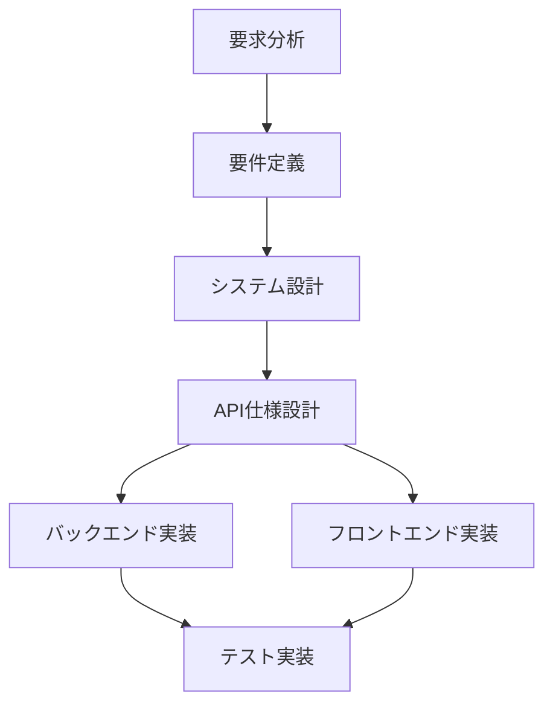
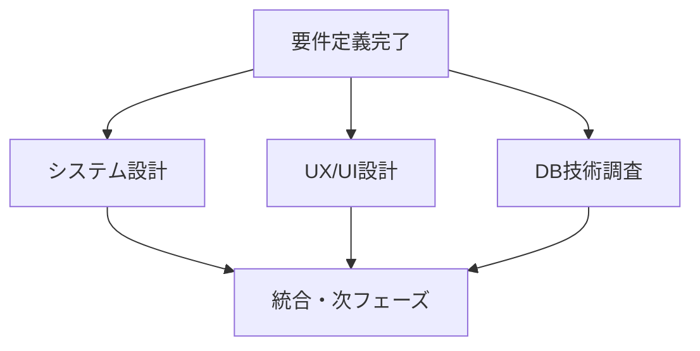
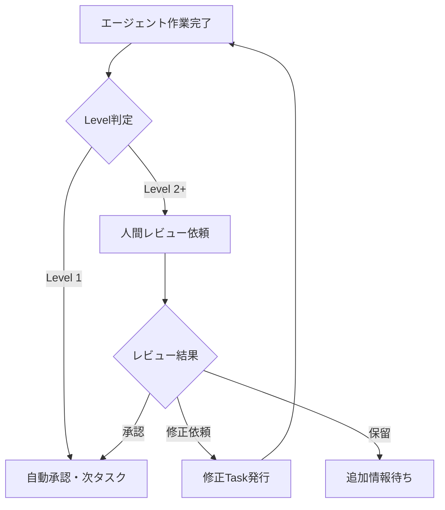

# Task呼び出し仕様書

## 概要

Claude CodeのTaskツールを使用したサブエージェント呼び出しの標準仕様、ベストプラクティス、エラーハンドリングを定義します。

## Taskツール基本仕様

### 基本構文

```python
Task(
    subagent_type="agent_name",
    description="short_description",
    prompt="detailed_prompt_with_context"
)
```

### 必須パラメータ

| パラメータ | 型 | 説明 | 例 |
|-----------|----|----|---|
| `subagent_type` | string | サブエージェント名 | `"requirements_analysis"` |
| `description` | string | タスク概要（3-5語） | `"要求分析作成"` |
| `prompt` | string | 詳細なタスク指示 | `"プロジェクト憲章に基づいて..."` |

## サブエージェント名一覧

### 利用可能なsubagent_type

```yaml
requirements_analysis:     # 要求分析エージェント
requirements_definition:   # 要件定義エージェント
ux_ui_design:             # UX/UIデザインエージェント
architect:                # アーキテクトエージェント
frontend:                 # フロントエンドエージェント
backend:                  # バックエンドエージェント
database:                 # データベースエージェント
test:                     # テストエージェント
security:                 # セキュリティエージェント
devops:                   # DevOpsエージェント
project_manager:          # プロジェクトマネージャーエージェント
```

## Task呼び出しパターン

### 1. 単一エージェント呼び出し

```python
# 基本的な単一タスク
Task(
    subagent_type="requirements_analysis",
    description="要求分析作成",
    prompt="""
## タスク概要
プロジェクト憲章とステークホルダーヒアリング結果から、Cinecomアプリケーションの要求分析を実施してください。

## 入力情報
- プロジェクト憲章: docs/project/charter.md
- ステークホルダーヒアリング議事録: docs/meetings/stakeholder_interviews/

## 期待する成果物
- 要求分析書: docs/project/requirements_analysis.md
- 課題・懸念事項リスト: docs/project/requirements_issues.md

## 品質基準
- 要求の曖昧性がない明確な記述
- 測定可能な非機能要求
- ステークホルダー承認可能な粒度
"""
)
```

### 2. 複数エージェント並列呼び出し

```python
# プロジェクトマネージャーからの並列Task発行例
# 一つのメッセージで複数のTask呼び出しを実行

# Phase 1開始 - 技術調査系タスク並列実行
Task(
    subagent_type="architect",
    description="技術スタック調査",
    prompt="""
マイクロサービス構成に適したNestJS + Next.js + PostgreSQLスタックの
技術調査を実施し、アーキテクチャの基本方針を検討してください。
"""
)

Task(
    subagent_type="database",
    description="DB技術調査",
    prompt="""
PostgreSQL + TypeORMでのマイクロサービス用DB設計の
技術調査を実施し、最適なDB構成を検討してください。
"""
)

Task(
    subagent_type="devops",
    description="インフラ技術調査",
    prompt="""
Vercel + Render環境でのマイクロサービスデプロイ戦略の
技術調査を実施し、CI/CDパイプライン基本設計を検討してください。
"""
)
```

### 3. 依存関係のある順次呼び出し

```python
# Phase 2開始 - 要件定義完了後のタスク発行
Task(
    subagent_type="architect",
    description="システム設計",
    prompt="""
## 前提条件
要件定義書が完成済み (docs/project/requirements.md)

## タスク概要
要件定義に基づいて、マイクロサービス構成のシステムアーキテクチャを設計してください。

## 依存入力
- docs/project/requirements.md (要件定義エージェントの成果物)
- docs/architecture/tech_research.md (技術調査結果)
"""
)

# システム設計完了後に自動発行されるタスク
Task(
    subagent_type="backend",
    description="API仕様設計",
    prompt="""
## 前提条件
システム設計が完成済み (docs/architecture/system_design.md)

## タスク概要
システム設計に基づいて、サービス間API仕様を詳細設計してください。
"""
)
```

### 4. 人間レビュー組み込みパターン

```python
# Level 2以上の重要な成果物での人間レビュー要求
Task(
    subagent_type="architect",
    description="システム設計レビュー",
    prompt="""
## タスク概要
完成したシステムアーキテクチャ設計の人間レビューを依頼し、
フィードバックに基づく修正を実施してください。

## レビュー対象
- docs/architecture/system_design.md
- docs/architecture/api_specification.md

## レビュー観点
1. マイクロサービス分割の妥当性
2. スケーラビリティ・可用性設計
3. セキュリティアーキテクチャ
4. 運用・監視考慮

## レビュープロセス
1. 成果物完成報告
2. 人間レビューの実施待機
3. フィードバック受領・反映
4. 承認確認後に次フェーズ移行
"""
)
```

## Prompt作成ベストプラクティス

### 1. 構造化された明確な指示

```python
# ✅ Good: 構造化された詳細prompt
Task(
    subagent_type="frontend",
    description="コンポーネント実装",
    prompt="""
## タスク概要
映画検索・一覧表示機能のReactコンポーネントを実装してください。

## 入力情報
- ワイヤーフレーム: docs/design/wireframes/movie_search.md
- API仕様: docs/architecture/api_specification.md (GET /movies)
- デザインガイドライン: docs/design/design_guidelines.md

## 期待する成果物
- frontend/components/MovieSearch.tsx
- frontend/components/MovieList.tsx
- frontend/pages/movies/index.tsx

## 技術要件
- Next.js 14 App Router利用
- TypeScript型安全性確保
- Tailwind CSS + Headless UI利用
- SWRでのデータフェッチング

## 品質基準
- ESLint/Prettier準拠
- コンポーネントテスト実装
- レスポンシブ対応
- アクセシビリティ対応（WCAG AA準拠）
"""
)

# ❌ Bad: 曖昧で不十分なprompt
Task(
    subagent_type="frontend",
    description="画面作成",
    prompt="映画検索画面を作ってください"
)
```

### 2. 入力・出力の明確な定義

```python
# ✅ Good: 入力・出力が明確
Task(
    subagent_type="test",
    description="APIテスト作成",
    prompt="""
## 入力情報（必須）
- backend/src/ (実装済みAPIコード)
- docs/architecture/api_specification.md (API仕様書)

## 期待する成果物（必須）
- tests/api/ (APIテストスイート)
  - GET /movies テスト
  - POST /movies テスト
  - PUT /movies/:id テスト
  - DELETE /movies/:id テスト

## 成果物品質基準
- カバレッジ80%以上
- エラーケーステスト含む
- 認証・認可テスト含む
"""
)
```

### 3. エラー処理・制約条件の明示

```python
# ✅ Good: 制約条件・エラー処理を明示
Task(
    subagent_type="backend",
    description="認証API実装",
    prompt="""
## 制約条件
- JWT + OAuth2 Google認証必須
- パスワードハッシュ化必須（bcrypt利用）
- レート制限実装必須（1分間10リクエスト）

## エラー処理要件
- 400: バリデーションエラー（詳細メッセージ付き）
- 401: 認証エラー（トークン無効・期限切れ）
- 403: 認可エラー（権限不足）
- 429: レート制限超過
- 500: サーバーエラー（ログ出力・Sentry通知）

## セキュリティ要件
- OWASP Top 10対策必須
- 個人情報暗号化必須
- CORS設定必須
"""
)
```

## エージェント間連携パターン

### 1. 順次実行パターン



```python
# 実装例：要求分析 → 要件定義
def phase1_requirements_flow():
    # Step 1: 要求分析
    Task(
        subagent_type="requirements_analysis",
        description="要求分析実行",
        prompt="..." # 詳細prompt
    )

    # Step 2: 要求分析完了後、要件定義を自動発行
    # プロジェクトマネージャーが完了を検知して次を発行
```

### 2. 並列実行パターン



```python
# 実装例：Phase 1並列タスク
def phase1_parallel_tasks():
    # 複数タスクを同時発行
    tasks = [
        Task(subagent_type="architect", description="技術調査", prompt="..."),
        Task(subagent_type="database", description="DB調査", prompt="..."),
        Task(subagent_type="ux_ui_design", description="UX調査", prompt="...")
    ]

    # プロジェクトマネージャーが全完了を待機
    # 全完了後にPhase 2移行
```

### 3. 人間レビュー組み込みパターン



## エラーハンドリング・リトライ戦略

### 1. 一般的なエラーパターン

```python
# エラーハンドリング例
def robust_task_execution():
    try:
        result = Task(
            subagent_type="backend",
            description="API実装",
            prompt="..."
        )

        # 成果物品質チェック
        if not validate_output(result):
            raise TaskQualityError("品質基準未達成")

    except TaskExecutionError as e:
        # Task実行エラー：リトライまたは代替案
        log_error(f"Task実行エラー: {e}")
        return retry_with_modified_prompt(e)

    except TaskQualityError as e:
        # 品質基準未達成：修正Task発行
        return Task(
            subagent_type="backend",
            description="品質改善",
            prompt=f"前回の成果物を以下の基準で改善してください: {e.criteria}"
        )
```

### 2. 依存関係エラー対応

```python
def dependency_aware_execution():
    # 依存リソースの存在チェック
    required_files = [
        "docs/project/requirements.md",
        "docs/architecture/system_design.md"
    ]

    missing_files = check_missing_dependencies(required_files)
    if missing_files:
        # ブロッカーレポート・代替案検討
        return escalate_dependency_issue(missing_files)

    # 依存解決後にTask実行
    return Task(subagent_type="backend", description="実装", prompt="...")
```

## 品質管理・監視

### 1. タスク実行監視

```yaml
# タスク監視指標
task_metrics:
  execution_time: "平均実行時間10分以内"
  success_rate: "成功率95%以上"
  quality_score: "品質基準達成率90%以上"
  dependency_resolution: "依存解決時間24時間以内"
```

### 2. 成果物品質チェック

```python
def quality_validation():
    quality_checks = {
        "requirements_analysis": validate_requirements_analysis,
        "system_design": validate_system_design,
        "backend": validate_backend_code,
        "frontend": validate_frontend_code,
        "test": validate_test_coverage
    }

    return quality_checks[subagent_type](output)
```

## 実践例：開発フロー全体

### Phase 1: プロジェクト基盤構築

```python
def execute_phase1():
    """Phase 1: 要求分析→要件定義→基盤技術調査"""

    # Step 1: 要求分析
    requirements_analysis = Task(
        subagent_type="requirements_analysis",
        description="要求分析実行",
        prompt=get_prompt_template("requirements_analysis", {
            "project_charter": "docs/project/charter.md",
            "stakeholder_interviews": "docs/meetings/stakeholder_interviews/",
            "focus_areas": ["映画・シーン検索機能", "マイクロサービス構成", "MVP範囲定義"]
        })
    )

    # Step 2: 要件定義（要求分析完了後）
    requirements_definition = Task(
        subagent_type="requirements_definition",
        description="要件定義作成",
        prompt=get_prompt_template("requirements_definition", {
            "input_analysis": "docs/project/requirements_analysis.md",
            "output_requirements": "docs/project/requirements.md",
            "output_user_stories": "docs/project/user_stories.md"
        })
    )

    # Step 3: 並列技術調査（要件定義完了後）
    tech_research_tasks = [
        Task(subagent_type="architect", description="技術スタック調査", prompt="..."),
        Task(subagent_type="database", description="DB技術調査", prompt="..."),
        Task(subagent_type="devops", description="インフラ調査", prompt="...")
    ]

    return [requirements_analysis, requirements_definition] + tech_research_tasks
```

## トラブルシューティング

### よくある問題と解決方法

| 問題 | 原因 | 解決方法 |
|-----|------|--------|
| Task実行失敗 | promptが不明確 | prompt構造化・詳細化 |
| 品質基準未達成 | 期待値が曖昧 | 具体的品質基準定義 |
| 依存関係ブロック | 入力リソース不足 | 依存関係事前チェック |
| レスポンス遅延 | prompt過度に複雑 | タスク適切な分割 |

---

**作成日**: 2025年8月22日
**最終更新**: 2025年8月22日
**目的**: Taskツール標準化による協調システム効率化
**対象**: 全プロジェクトメンバー・エージェント
**次回レビュー**: エージェント間連携プロトコル完成時
