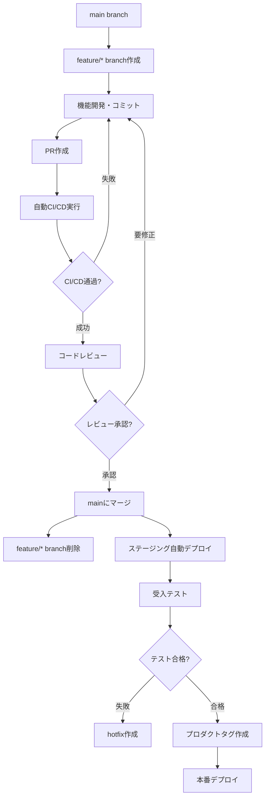

# Git戦略・ワークフロー

## Cinecom プロジェクト - マイクロサービス開発

### 概要

本ドキュメントは、Cinecomプロジェクトで採用するGit戦略とワークフローを定義します。マイクロサービス構成での効率的な開発・デプロイメントフローを実現する運用方法を詳述します。

### ブランチ戦略: GitHub Flow

#### **基本ブランチ構成**

```yaml
main:
  役割: 本番デプロイ対象ブランチ
  特徴:
    - 常にデプロイ可能な状態を維持
    - 全てのPRがこのブランチにマージ
    - プロダクションタグの起点
  保護設定:
    - 直接プッシュ禁止
    - PR必須
    - レビュー必須（2人以上承認）
    - CI/CD通過必須

feature/*:
  役割: 機能開発ブランチ
  命名規則: feature/[agent-name]/[feature-description]
  例:
    - feature/backend/user-authentication
    - feature/frontend/movie-search-ui
    - feature/database/scene-schema-design
  特徴:
    - mainブランチから作成
    - 機能完成後にPRでmainにマージ
    - マージ後削除

hotfix/*:
  役割: 緊急修正ブランチ
  命名規則: hotfix/[issue-description]
  例:
    - hotfix/security-vulnerability-fix
    - hotfix/critical-api-error
  特徴:
    - mainブランチから緊急作成
    - 修正後即座にmainにマージ
    - タグ作成・緊急デプロイ
```

#### **GitHub Flow ワークフロー**



### コミット規約

#### **Conventional Commits**

```yaml
フォーマット:
  <type>[optional scope]: <description>
  
  [optional body]
  
  [optional footer(s)]

例:
  feat(user-service): add OAuth2 authentication
  fix(movie-service): resolve search query performance issue
  docs(architecture): update microservices design document
  test(scene-service): add unit tests for scene categorization
```

#### **Type定義**

```yaml
feat: 新機能追加
  例: feat(frontend): implement movie search interface

fix: バグ修正
  例: fix(backend): resolve database connection timeout

docs: ドキュメント変更
  例: docs(api): update authentication endpoints

style: コードスタイル変更（機能に影響なし）
  例: style(frontend): fix ESLint warnings

refactor: リファクタリング（機能変更なし）
  例: refactor(database): optimize query performance

test: テスト追加・修正
  例: test(review-service): add integration tests

chore: ビルド・設定変更
  例: chore(ci): update GitHub Actions workflow

perf: パフォーマンス改善
  例: perf(actor-service): implement Redis caching

security: セキュリティ関連修正
  例: security(auth): fix JWT token validation
```

#### **Scope定義（マイクロサービス別）**

```yaml
サービス別scope:
  - user-service: ユーザー管理・認証関連
  - movie-service: 映画データ管理関連
  - actor-service: 俳優・キャスト管理関連
  - scene-service: シーンデータ管理関連
  - review-service: レビュー・評価管理関連
  - frontend: フロントエンドUI関連

共通scope:
  - api: API仕様・設計関連
  - database: データベース関連
  - architecture: システム設計関連
  - deployment: デプロイ・インフラ関連
  - ci: CI/CD関連
  - docs: ドキュメント関連
```

### プルリクエスト運用

#### **PR作成ルール**

```yaml
必須項目:
  - 明確なタイトル（Conventional Commits準拠）
  - 変更内容の詳細説明
  - 影響を受けるサービス・エージェントの明記
  - テスト実行結果
  - レビュー依頼理由

テンプレート:
  # Pull Request

  ## 変更概要
  [変更内容の簡潔な説明]

  ## 変更詳細
  - [具体的な変更点1]
  - [具体的な変更点2]

  ## 影響を受けるサービス・エージェント
  - [ ] user-service
  - [ ] movie-service  
  - [ ] actor-service
  - [ ] scene-service
  - [ ] review-service
  - [ ] frontend

  ## テスト結果
  - [ ] Unit Tests: [Pass/Fail]
  - [ ] Integration Tests: [Pass/Fail]
  - [ ] E2E Tests: [Pass/Fail]
  - [ ] Manual Tests: [実施内容]

  ## 影響度レベル
  - [ ] Level 1 (自律判断)
  - [ ] Level 2 (関連エージェント協議)
  - [ ] Level 3 (全体合意 + 人間承認)

  ## レビューポイント
  [特に注意して見てほしい点]

  ## その他
  [追加情報・補足事項]
```

#### **レビュープロセス**

```yaml
自動チェック:
  1. CI/CDパイプライン実行
  2. コード品質チェック（ESLint、SonarQube）
  3. テスト実行・カバレッジ確認
  4. セキュリティスキャン
  5. ビルド成功確認

レビュー要件:
  Level 1: 担当エージェント + CI/CD通過
  Level 2: 関連エージェント2名以上 + CI/CD通過
  Level 3: 全関連エージェント + 人間レビュアー + CI/CD通過

レビュー基準:
  - コード品質・可読性
  - アーキテクチャ・設計の適切性
  - テストカバレッジ・品質
  - ドキュメント更新
  - セキュリティ考慮
  - パフォーマンス影響評価
```

### マイクロサービス別デプロイフロー

#### **環境別デプロイ戦略**

**開発環境 (Development)**:

```yaml
デプロイ対象: feature/*, hotfix/* ブランチ
トリガー: プッシュ時の自動デプロイ
目的: 各エージェントの個別機能確認
デプロイ方式: ブランチ別並行デプロイ

実装例:
  - feature/user-auth → dev-user-auth.cinecom-dev.com
  - feature/movie-search → dev-movie.cinecom-dev.com
  - feature/scene-management → dev-scene.cinecom-dev.com

設定:
  # GitHub Actions
  on:
    push:
      branches: 
        - 'feature/**'
        - 'hotfix/**'
  
  env:
    DEPLOY_ENV: development
    SUBDOMAIN: ${{ github.ref_name }}
```

**ステージング環境 (Staging)**:

```yaml
デプロイ対象: main ブランチ
トリガー: mainブランチへのマージ時（サービス単位で継続的デプロイ）
目的: 受入テスト・QA検証・統合テスト
デプロイ方式: mainの最新状態を反映

実装例:
  - user-service main → staging-user.cinecom.com
  - movie-service main → staging-movie.cinecom.com
  - scene-service main → staging-scene.cinecom.com
  - frontend main → staging.cinecom.com

変更検出デプロイ:
  # GitHub Actions
  on:
    push:
      branches: [main]
      paths: 
        - 'services/user-service/**'
        - 'services/movie-service/**'
        - 'services/actor-service/**'
        - 'services/scene-service/**'
        - 'services/review-service/**'
        - 'frontend/**'
```

**本番環境 (Production)**:

```yaml
デプロイ対象: main ブランチ (プロダクトタグ v1.x.x)
トリガー: プロダクトリリースタグ作成時
目的: エンドユーザー提供
デプロイ方式: 統合バージョンでの一括デプロイ

実装例:
  - プロダクトタグ v1.1.0 → 全サービスの特定コミット組み合わせ
  - 各サービスバージョンの組み合わせを記録
  - 本番環境への一括デプロイ

タグベースデプロイ:
  # GitHub Actions
  on:
    release:
      types: [published]
    
  steps:
    - name: Extract version
      run: echo "VERSION=${GITHUB_REF#refs/tags/}" >> $GITHUB_ENV
    
    - name: Deploy production
      run: |
        echo "Deploying version $VERSION to production"
        # デプロイスクリプト実行
```

#### **マイクロサービス用CI/CD**

**サービス別ステージングデプロイ**:

```yaml
# .github/workflows/staging-deploy.yml
name: Staging Deploy

on:
  push:
    branches: [main]

jobs:
  detect-changes:
    runs-on: ubuntu-latest
    outputs:
      user-service: ${{ steps.changes.outputs.user-service }}
      movie-service: ${{ steps.changes.outputs.movie-service }}
      actor-service: ${{ steps.changes.outputs.actor-service }}
      scene-service: ${{ steps.changes.outputs.scene-service }}
      review-service: ${{ steps.changes.outputs.review-service }}
      frontend: ${{ steps.changes.outputs.frontend }}
    steps:
      - uses: actions/checkout@v4
      - uses: dorny/paths-filter@v2
        id: changes
        with:
          filters: |
            user-service:
              - 'services/user-service/**'
            movie-service:
              - 'services/movie-service/**'
            actor-service:
              - 'services/actor-service/**'
            scene-service:
              - 'services/scene-service/**'
            review-service:
              - 'services/review-service/**'
            frontend:
              - 'frontend/**'

  deploy-user-service:
    needs: detect-changes
    if: needs.detect-changes.outputs.user-service == 'true'
    runs-on: ubuntu-latest
    steps:
      - uses: actions/checkout@v4
      - name: Deploy user-service to staging
        run: |
          cd services/user-service
          docker build -t cinecom-user-service:${{ github.sha }} .
          # Render.com or 他のサービスにデプロイ

  deploy-movie-service:
    needs: detect-changes
    if: needs.detect-changes.outputs.movie-service == 'true'
    runs-on: ubuntu-latest
    steps:
      - uses: actions/checkout@v4
      - name: Deploy movie-service to staging
        run: |
          cd services/movie-service
          docker build -t cinecom-movie-service:${{ github.sha }} .
          # Render.com or 他のサービスにデプロイ

  # 他のサービスも同様...
```

**プロダクトタグベース本番デプロイ**:

```yaml
# .github/workflows/production-deploy.yml
name: Production Deploy

on:
  release:
    types: [published]

jobs:
  deploy-production:
    runs-on: ubuntu-latest
    steps:
      - uses: actions/checkout@v4
      
      - name: Create deployment manifest
        run: |
          echo "Creating deployment manifest for ${{ github.ref_name }}"
          cat > deployment-manifest.json << EOF
          {
            "version": "${{ github.ref_name }}",
            "timestamp": "$(date -u +%Y-%m-%dT%H:%M:%SZ)",
            "services": {
              "user-service": "$(git rev-parse HEAD:services/user-service)",
              "movie-service": "$(git rev-parse HEAD:services/movie-service)",
              "actor-service": "$(git rev-parse HEAD:services/actor-service)",
              "scene-service": "$(git rev-parse HEAD:services/scene-service)",
              "review-service": "$(git rev-parse HEAD:services/review-service)",
              "frontend": "$(git rev-parse HEAD:frontend)"
            }
          }
          EOF
      
      - name: Deploy all services
        run: |
          echo "Deploying all services to production"
          # 各サービスの本番デプロイ実行
          for service in user movie actor scene review; do
            echo "Deploying ${service}-service"
            cd services/${service}-service
            docker build -t cinecom-${service}-service:${{ github.ref_name }} .
            # 本番環境デプロイ
            cd ../..
          done
          
          # フロントエンドデプロイ
          echo "Deploying frontend"
          cd frontend
          # Vercel デプロイ
          cd ..
      
      - name: Store deployment history
        run: |
          mkdir -p .deployment-history
          cp deployment-manifest.json .deployment-history/${{ github.ref_name }}.json
          git config user.name "github-actions"
          git config user.email "actions@github.com"
          git add .deployment-history/
          git commit -m "Add deployment history for ${{ github.ref_name }}"
          git push
```

### バージョン管理戦略

#### **プロダクトレベルのセマンティックバージョニング**

```yaml
バージョン形式: MAJOR.MINOR.PATCH (例: v1.2.3)

MAJOR (1.x.x):
  - 互換性のない根本的変更
  - アーキテクチャ大幅変更
  - API Breaking Changes

MINOR (x.1.x):
  - 後方互換性のある機能追加
  - 新しいマイクロサービス追加
  - 既存API拡張

PATCH (x.x.1):
  - 後方互換性のあるバグ修正
  - セキュリティ修正
  - パフォーマンス改善

リリース例:
  v1.0.0: 初回リリース
    - user-service: commit abc123
    - movie-service: commit def456
    - scene-service: commit ghi789
    - review-service: commit jkl012
    - frontend: commit mno345

  v1.1.0: 機能追加 (シーン管理機能)
    - user-service: commit abc789 (認証強化)
    - movie-service: commit def890 (検索最適化)
    - actor-service: commit ghi456 (キャスト管理機能)
    - scene-service: commit jkl123 (新機能)
    - review-service: commit mno456 (UI改善)
    - frontend: commit pqr678 (新UI実装)

  v1.1.1: バグ修正
    - user-service: commit abc789 (変更なし)
    - movie-service: commit def999 (検索バグ修正)
    - actor-service: commit ghi456 (変更なし)
    - scene-service: commit jkl123 (変更なし)
    - review-service: commit mno456 (変更なし)
    - frontend: commit pqr789 (UI修正)
```

#### **タグ作成・管理**

```yaml
タグ作成プロセス:
  1. ステージング環境での受入テスト完了
  2. 全サービスの動作確認
  3. セキュリティ・パフォーマンステスト合格
  4. リリースノート作成
  5. プロダクトタグ作成・GitHub Release公開

タグ命名規則:
  - プロダクトリリース: v1.2.3
  - リリース候補: v1.2.3-rc.1
  - ベータリリース: v1.2.3-beta.1
  - アルファリリース: v1.2.3-alpha.1

自動タグ作成:
  # package.jsonのversion更新後
  npm version major|minor|patch
  git push origin main --tags
```

### CODEOWNERS設定

#### **レビュー責任者設定**

```bash
# .github/CODEOWNERS

# Global
* @pm-agent

# Services
/services/user-service/ @backend-agent @database-agent
/services/movie-service/ @backend-agent @database-agent  
/services/actor-service/ @backend-agent @database-agent
/services/scene-service/ @backend-agent @database-agent
/services/review-service/ @backend-agent @database-agent

# Frontend
/frontend/ @frontend-agent @ux-agent

# Infrastructure & DevOps
/.github/ @devops-agent @pm-agent
/docker-compose.yml @devops-agent
/Dockerfile* @devops-agent
/.dockerignore @devops-agent

# Documentation
/docs/architecture/ @architect-agent @backend-agent @frontend-agent
/docs/api/ @backend-agent @frontend-agent @human-reviewer
/docs/database/ @database-agent @backend-agent
/docs/design/ @ux-agent @frontend-agent
/docs/project/ @pm-agent @human-reviewer

# Database & Migrations
/migrations/ @database-agent @backend-agent @human-reviewer
/models/ @database-agent @backend-agent

# Configuration
/config/ @devops-agent @backend-agent
/.env* @devops-agent @backend-agent
/package.json @devops-agent
/package-lock.json @devops-agent

# Tests
/tests/ @test-agent
/**/*.test.* @test-agent
/**/*.spec.* @test-agent

# Security
/security/ @security-agent @human-reviewer
/.github/workflows/ @devops-agent @security-agent

# Critical files (human review required)
/docs/project/charter.md @pm-agent @human-reviewer
/README.md @pm-agent @human-reviewer
```

### ホットフィックス戦略

#### **緊急修正フロー**

```yaml
ホットフィックス対象:
  - セキュリティ脆弱性
  - 本番環境クリティカル障害
  - データ整合性問題
  - ユーザー影響大の不具合

フロー:
  1. 緊急事態宣言（Discord #cinecom-urgent）
  2. hotfix/[issue-description] ブランチ作成
  3. 最小限の修正実装
  4. 緊急テスト実行
  5. 緊急レビュー（時間短縮、必要最小限）
  6. mainブランチに緊急マージ
  7. 緊急タグ作成（例: v1.2.4）
  8. 本番環境緊急デプロイ
  9. 動作確認・監視強化
  10. 事後検証・再発防止策

緊急時短縮ルール:
  - レビュー要件緩和（担当エージェント1名＋人間レビュアー）
  - CI/CD必須項目のみ実行
  - ドキュメント更新は事後対応
```

### Git操作ベストプラクティス

#### **コミット作成**

```bash
# 1. 変更をステージング
git add [files]

# 2. Conventional Commitsでコミット
git commit -m "feat(movie-service): add advanced search filters

- Add genre-based filtering
- Add release year range filtering  
- Add rating-based sorting
- Update API documentation

Closes #123"

# 3. プッシュ前に最新取得
git pull origin main --rebase

# 4. プッシュ
git push origin feature/movie-service/advanced-search
```

#### **ブランチ操作**

```bash
# 1. 最新のmainから機能ブランチ作成
git checkout main
git pull origin main
git checkout -b feature/frontend/user-profile-ui

# 2. 定期的なmainマージ（競合回避）
git checkout main
git pull origin main
git checkout feature/frontend/user-profile-ui
git merge main

# 3. PR作成前の最終確認
git checkout main
git pull origin main
git checkout feature/frontend/user-profile-ui
git rebase main
git push origin feature/frontend/user-profile-ui --force-with-lease
```

#### **マージ戦略**

```yaml
マージ方針:
  - feature/* → main: Squash and Merge
    理由: 履歴をクリーンに保つ、atomic change
  
  - hotfix/* → main: Merge Commit
    理由: 緊急修正の明確な履歴保持
  
  - main → リリース: Merge Commit
    理由: リリースポイントの明確化

禁止事項:
  - main ブランチへの直接プッシュ
  - force push to main
  - マージ後のfeatureブランチ削除忘れ
  - レビューなしでのマージ
```

### 課題・トラブルシューティング

#### **よくある問題と対処法**

```yaml
マージ競合:
  予防: 定期的なmainマージ、小さなPR
  対処: git rebase main → 競合解決 → git add → git rebase --continue

CI/CD失敗:
  原因: テスト失敗、ビルドエラー、リント警告
  対処: ローカル確認 → 修正 → force-with-lease push

レビュー遅延:
  対応: Discord通知確認、レビュアー変更、緊急時は人間エスカレーション

コミット履歴汚れ:
  対処: git rebase -i で履歴整理（プッシュ前のみ）

ブランチ管理複雑化:
  対応: 定期的な不要ブランチ削除、命名規則厳守
```

### 監視・メトリクス

#### **Git運用メトリクス**

```yaml
開発効率:
  - PR作成から マージまでの平均時間
  - レビュー完了までの平均時間
  - CI/CD失敗率
  - コンフリクト発生率

品質指標:
  - コミット粒度の適切性
  - コミットメッセージ品質
  - レビューコメント数
  - ホットフィックス頻度

協調指標:
  - エージェント別コミット数・頻度
  - レビュー参加率
  - ブランチ長期化率
```

### 関連ドキュメント

- **CI/CDパイプライン**: `/docs/development/ci_cd_pipeline.md` - 詳細なビルド・デプロイ設定
- **コーディング規約**: `/docs/development/coding_standards.md` - コード品質基準
- **テスト戦略**: `/docs/development/testing_strategy.md` - テストプロセス詳細
- **デプロイ戦略**: `/docs/operations/deployment_guide.md` - インフラ・デプロイ詳細

### 更新履歴

- **v1.0** (2025-08-22): 初版作成 - GitHub Flow + マイクロサービス戦略
- **次回更新予定**: Phase 1完了時（Week 2終了時）- 実運用経験による調整

---

**重要**: Git戦略は開発効率と品質のバランスを重視します。ルールに縛られすぎず、プロジェクトの成功に向けた柔軟な運用を心がけてください。
