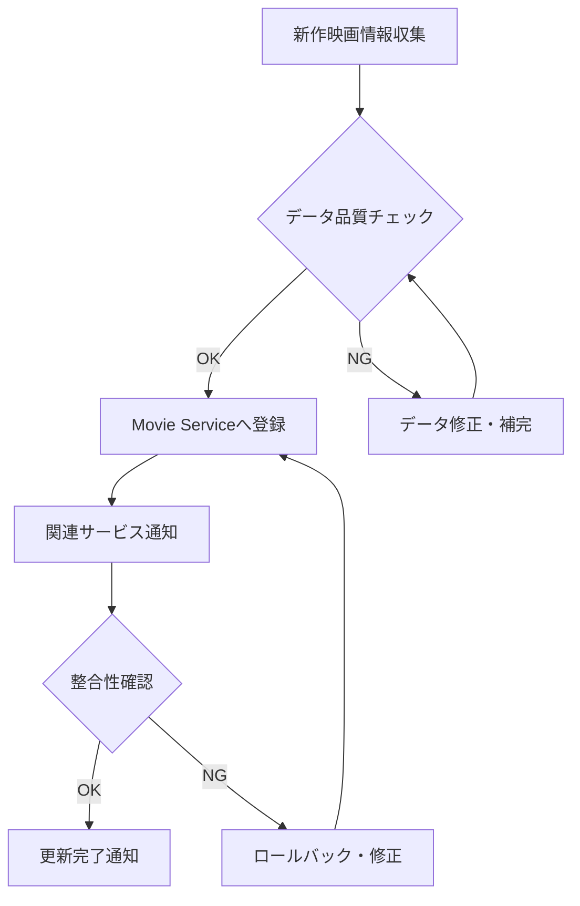
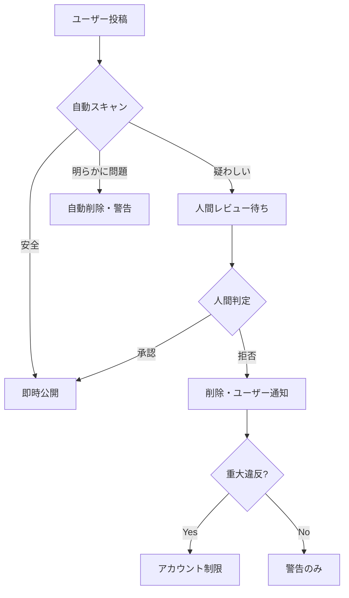

# 運用・保守体制詳細計画書

**調査ID**: R-005
**作成日**: 2025-04-16
**担当**: プロジェクトマネージャー + 運用担当
**優先度**: High

---

## 1. データメンテナンス体制

### 1.1 映画情報更新体制

#### 更新担当者・役割分担

```yaml
主担当: 佐藤氏（配給会社関係者）
  責任範囲:
    - 新作映画情報の月次更新（20-30作品/月）
    - 配給会社提供データの品質管理
    - 映画基本情報（タイトル・監督・キャスト等）の正確性確認

  作業時間: 10時間/月
  更新サイクル: 毎月第1営業日

副担当: プロジェクトマネージャー
  責任範囲:
    - 緊急時の代理更新
    - データ更新プロセスの監督
    - 品質問題発生時のエスカレーション対応

  作業時間: 2-5時間/月（平時）、20時間/月（問題発生時）
```

#### 映画情報更新プロセス



#### 更新頻度・スケジュール

| 更新対象 | 頻度 | 担当者 | 所要時間 |
|---------|------|--------|----------|
| **新作映画基本情報** | 月次 | 佐藤氏 | 6時間 |
| **キャスト情報追加** | 月次 | 佐藤氏 | 3時間 |
| **配給・上映情報** | 週次 | 佐藤氏 | 1時間 |
| **緊急修正** | 随時 | PM | 30分-2時間 |

### 1.2 シーン分類品質管理プロセス

#### 分類品質管理体制

```yaml
品質管理責任者: 田中氏（映画愛好家代表）
  責任範囲:
    - シーン分類ガイドライン策定・更新
    - 分類品質の定期監査（月次）
    - 分類者向けトレーニング実施
    - 品質問題発生時の修正指示

  作業時間: 8時間/月

品質監査担当: 山田氏（業界関係者）
  責任範囲:
    - 専門的観点でのシーン分類レビュー
    - 学術的・業界的妥当性の確認
    - 分類基準の客観化支援

  作業時間: 4時間/月

自動品質チェック: システム
  実装範囲:
    - 分類階層の整合性チェック
    - 時間オーバーラップの妥当性確認
    - 必須フィールドの入力確認
    - 異常値・外れ値の検出
```

#### 品質管理プロセスフロー

```yaml
事前チェック（入力時）:
  1. 自動バリデーション（システム）
  2. リアルタイム警告表示
  3. 保存前の確認ダイアログ

事後チェック（定期監査）:
  1. 月次品質レポート生成（システム）
  2. サンプル監査（田中氏・山田氏）
  3. 問題発見時の修正指示
  4. 修正完了後の再監査

品質メトリクス:
  - 分類一貫性率: 90%以上
  - データ完全性: 95%以上
  - ユーザー報告エラー率: 5%以下
```

### 1.3 ユーザー投稿コンテンツのモデレーション

#### モデレーション体制

```yaml
1次モデレーション: 自動システム
  対象: レビュー・コメント・タグ投稿
  方法:
    - NGワードフィルタリング
    - スパム検出（文字列パターン・投稿頻度）
    - 不適切画像検出（AI）

  処理時間: リアルタイム（投稿時）
  自動処理率: 80-90%

2次モデレーション: 人間確認
  担当者: コミュニティマネージャー（外部委託想定）
  対象: 自動検出で判定困難なコンテンツ

  処理時間: 24時間以内
  作業量見込み: 2-4時間/日
  月額コスト: ¥80,000-150,000
```

#### モデレーションフロー



---

## 2. システム運用体制

### 2.1 監視・アラート体制

#### 24時間監視の必要性評価

```yaml
監視レベル分類:

Level 1 - Critical（24時間対応必要）:
  対象:
    - サーバーダウン・接続不可
    - データベース接続障害
    - セキュリティインシデント

  対応時間: 15分以内に初動
  対応者: DevOpsエージェント + 人間エスカレーション

Level 2 - High（営業時間対応）:
  対象:
    - 性能劣化（応答時間5秒超過）
    - API エラー率上昇（>5%）
    - ディスク容量不足警告

  対応時間: 2時間以内
  対応者: 運用チーム

Level 3 - Medium（翌営業日対応）:
  対象:
    - 軽微な機能不具合
    - ログエラー増加
    - ユーザビリティ問題報告

  対応時間: 翌営業日中
  対応者: 開発チーム
```

#### アラート通知体制

```yaml
通知チャネル:
  Critical: Discord + Email + SMS
  High: Discord + Email
  Medium: Discord のみ

通知先:
  DevOps担当: 全レベル
  プロジェクトマネージャー: Critical + High
  開発チーム: High + Medium
  ステークホルダー: Critical のみ（サービス停止時）

エスカレーション:
  1次: 15分以内に応答がない場合
  2次: 30分以内に解決しない場合
  3次: 1時間以内に解決しない場合→人間担当者連絡
```

### 2.2 障害対応エスカレーションフロー

#### インシデント分類・対応フロー

```yaml
Severity 1 - Critical:
  定義: サービス全停止・データ損失リスク
  対応時間: 15分以内に初動開始

  対応フロー:
    1. 自動検知・アラート発信（0分）
    2. DevOpsエージェント初動対応開始（15分以内）
    3. プロジェクトマネージャー参加（30分以内）
    4. 人間担当者エスカレーション（1時間以内）
    5. ステークホルダー状況報告（2時間以内）

Severity 2 - High:
  定義: 一部機能停止・性能大幅劣化
  対応時間: 2時間以内に初動開始

  対応フロー:
    1. 自動検知・アラート発信（0分）
    2. 運用チーム対応開始（2時間以内）
    3. 開発チーム参加（4時間以内）
    4. 進捗報告・解決見込み連絡（8時間以内）

Severity 3 - Medium:
  定義: 軽微な機能問題・ユーザビリティ問題
  対応時間: 翌営業日中

  対応フロー:
    1. 問題レポート受信
    2. 開発チーム調査・対応
    3. 修正・テスト・デプロイ
    4. 解決通知
```

### 2.3 定期メンテナンス計画

#### メンテナンススケジュール

| 種別 | 頻度 | 実施時間 | 所要時間 | 担当者 |
|------|------|----------|----------|---------|
| **セキュリティ更新** | 週次 | 日曜 2:00-4:00 | 2時間 | DevOps |
| **データベースメンテナンス** | 月次 | 第1日曜 1:00-5:00 | 4時間 | DB担当 |
| **サーバーリブート** | 月次 | 第1日曜 4:00-5:00 | 1時間 | DevOps |
| **バックアップ検証** | 月次 | 第2土曜 10:00-12:00 | 2時間 | 運用チーム |
| **災害復旧訓練** | 四半期 | 第3土曜 9:00-17:00 | 8時間 | 全チーム |

#### メンテナンス通知・準備プロセス

```yaml
事前通知:
  - 7日前: ステークホルダー通知（重大メンテナンス）
  - 3日前: ユーザー通知（サイト・API経由）
  - 1日前: チーム最終確認
  - 30分前: 作業開始準備

メンテナンス実行:
  1. サービス状況確認・記録
  2. メンテナンスモード切替
  3. 作業実行・進捗記録
  4. 動作確認・テスト
  5. メンテナンスモード解除
  6. サービス復旧確認
  7. 完了報告・記録保存

緊急時手順:
  - 問題発生時の即時ロールバック
  - ステークホルダー緊急連絡
  - 問題調査・修正計画策定
```

---

## 3. ユーザーサポート体制

### 3.1 問い合わせ対応チャネル

#### サポートチャネル構成

```yaml
1次サポート: FAQ・ヘルプページ
  対応範囲: よくある質問・基本操作説明
  利用率見込み: 60-70%
  維持コスト: 月額¥10,000（コンテンツ更新）

2次サポート: チャットボット
  対応範囲: 定型的質問・アカウント関連
  利用率見込み: 20-25%
  導入・維持コスト: 月額¥30,000

3次サポート: メールサポート
  対応範囲: 複雑な技術問題・要望
  利用率見込み: 10-15%
  運用コスト: 月額¥80,000（外部委託）
```

#### 問い合わせ分類・対応時間

| 問い合わせ種別 | 対応時間目標 | 担当者 | 月間見込み件数 |
|-------------|-------------|--------|--------------|
| **アカウント関連** | 24時間以内 | サポート担当 | 20-30件 |
| **操作方法・使い方** | 48時間以内 | サポート担当 | 40-60件 |
| **技術的問題** | 72時間以内 | 開発チーム | 10-20件 |
| **機能要望・提案** | 1週間以内 | プロダクトチーム | 5-10件 |
| **データ品質問題** | 48時間以内 | データ管理チーム | 5-15件 |

### 3.2 FAQ・ヘルプドキュメント整備

#### ドキュメント構成

```yaml
基本操作ガイド:
  - アカウント作成・ログイン
  - シーン検索の基本操作
  - 分類機能の使い方
  - お気に入り・ウォッチリスト管理

高度な機能ガイド:
  - 複雑検索条件の設定
  - データエクスポート機能
  - 統計・分析機能の利用
  - プロフェッショナル機能

トラブルシューティング:
  - 検索結果が表示されない
  - ログインできない
  - データが正しく表示されない
  - 動作が重い・遅い

API ドキュメント（開発者向け）:
  - 認証・アクセス方法
  - エンドポイント一覧
  - リクエスト・レスポンス例
  - エラーコード・対処方法
```

#### ドキュメント更新・管理体制

```yaml
更新責任者: UX/UIエージェント + テクニカルライター
更新タイミング:
  - 新機能リリース時（必須）
  - ユーザー問い合わせ増加時（月次レビュー）
  - システム仕様変更時

品質管理:
  - ユーザビリティテスト（四半期）
  - 検索性・見つけやすさ改善
  - 多言語対応（将来）

メンテナンスコスト: 月額¥50,000（外部ライター・翻訳）
```

### 3.3 ユーザートレーニング計画

#### ターゲット別トレーニング計画

```yaml
一般ユーザー向け:
  方法: オンラインチュートリアル・動画ガイド
  内容:
    - 基本的なシーン検索方法
    - お気に入り機能の活用
    - コミュニティ機能の利用方法

  提供方法: ウェブサイト・YouTube
  更新頻度: 機能更新時
  制作コスト: 初期¥200,000、更新¥50,000/回

プロフェッショナル向け:
  方法: ウェビナー・専用ガイド
  内容:
    - 高度検索機能の活用
    - データエクスポート・分析
    - API利用方法

  提供方法: 月次ウェビナー（1時間）
  参加者見込み: 20-30名
  運用コスト: 月額¥30,000

データ入力者向け:
  方法: 対面・オンライン研修
  内容:
    - シーン分類基準の理解
    - データ入力ツールの使い方
    - 品質管理・確認方法

  提供頻度: 四半期（新規入力者向け）
  講師: 田中氏・山田氏
  研修コスト: ¥100,000/回
```

---

## 4. 運用コスト見積もり

### 4.1 人的リソースコスト

#### 月額人件費見積もり

| 役割 | 担当者 | 時間/月 | 時給換算 | 月額コスト |
|------|--------|---------|----------|-----------|
| **データメンテナンス** | 佐藤氏 | 10時間 | ¥5,000 | ¥50,000 |
| **品質管理** | 田中氏 | 8時間 | ¥5,000 | ¥40,000 |
| **専門監査** | 山田氏 | 4時間 | ¥8,000 | ¥32,000 |
| **サポート対応** | 外部委託 | - | - | ¥80,000 |
| **コンテンツモデレーション** | 外部委託 | - | - | ¥120,000 |
| **ドキュメント管理** | 外部ライター | - | - | ¥50,000 |

**月額人件費合計**: ¥372,000

### 4.2 システム・ツールコスト

#### 月額システムコスト

| カテゴリ | ツール・サービス | 月額コスト |
|----------|----------------|-----------|
| **監視・アラート** | Sentry + Discord Webhook | ¥15,000 |
| **バックアップ** | 自動バックアップ・ストレージ | ¥8,000 |
| **チャットボット** | 外部サービス | ¥30,000 |
| **ドキュメント** | ナレッジベース・CMS | ¥10,000 |
| **トレーニング** | ビデオホスティング・配信 | ¥12,000 |

**月額システムコスト合計**: ¥75,000

### 4.3 総運用コスト

```yaml
Phase 1-2（プロトタイプ・MVP）:
  人件費: ¥200,000/月（基本体制のみ）
  システム: ¥30,000/月（最小構成）
  合計: ¥230,000/月

Phase 3-4（本格運用）:
  人件費: ¥372,000/月（フル体制）
  システム: ¥75,000/月（全機能）
  合計: ¥447,000/月

年間運用コスト見込み:
  Year 1: ¥3,400,000（Phase移行含む）
  Year 2以降: ¥5,360,000/年
```

---

## 5. 品質保証・SLA（サービスレベル合意）

### 5.1 サービス稼働率目標

```yaml
稼働率目標:
  Phase 1-2: 99.0%（月間ダウンタイム7.3時間以内）
  Phase 3-4: 99.5%（月間ダウンタイム3.6時間以内）

計画メンテナンス:
  月次メンテナンス: 4時間/月
  緊急メンテナンス: 2時間/月（平均）

可用性計算:
  稼働時間 = 月間総時間 - 計画メンテナンス - 障害時間
  目標: 99.5% = (720時間 - 6時間) / 720時間
```

### 5.2 性能保証目標

```yaml
応答時間保証:
  基本検索: 95%のクエリが3秒以内
  複雑検索: 90%のクエリが5秒以内
  データエクスポート: 90%が1分以内

スループット保証:
  同時接続: 500ユーザー（Phase 2）、1,000ユーザー（Phase 3）
  API リクエスト: 100req/秒

データ整合性保証:
  データ損失: 0件（バックアップ・レプリケーション）
  分類品質: 90%以上の一貫性
```

### 5.3 サポート品質目標

```yaml
問い合わせ対応:
  初回応答: 24時間以内（90%以上）
  解決時間: 72時間以内（80%以上）
  顧客満足度: 4.0/5.0以上

ドキュメント品質:
  情報の正確性: 95%以上
  更新頻度: 機能リリース後1週間以内
  ユーザビリティ: タスク成功率80%以上
```

---

## 6. 継続的改善プロセス

### 6.1 運用改善サイクル

```yaml
月次レビュー:
  - サービス稼働率・性能実績確認
  - ユーザー問い合わせ傾向分析
  - コスト・工数実績確認
  - 改善施策検討・実施

四半期レビュー:
  - SLA達成状況確認
  - 運用体制・プロセス見直し
  - コスト効率化施策検討
  - ユーザー満足度調査・分析

年次レビュー:
  - 運用戦略見直し
  - 技術スタック・ツール見直し
  - 体制拡張・縮小判断
  - 中長期計画更新
```

### 6.2 自動化・効率化推進

```yaml
短期自動化目標（6ヶ月以内）:
  - デプロイメント自動化
  - バックアップ・復旧自動化
  - 基本問い合わせ自動対応
  - 監視アラート自動トリアージ

中期自動化目標（1年以内）:
  - データ品質チェック自動化
  - レポート生成自動化
  - 容量・性能予測自動化
  - インシデント対応自動化（部分）

長期自動化目標（2年以内）:
  - シーン分類半自動化
  - ユーザーサポート高度自動化
  - 予防保守自動化
  - 運用コスト最適化AI
```

---

## 7. リスク管理・事業継続計画

### 7.1 運用リスク識別・対策

| リスク | 発生確率 | 影響度 | 対策 |
|--------|----------|--------|------|
| **キー担当者離脱** | 中 | 高 | 業務引き継ぎ・ドキュメント化 |
| **外部委託先問題** | 中 | 中 | 複数ベンダー・SLA契約 |
| **データ品質劣化** | 高 | 中 | 自動チェック・定期監査 |
| **ユーザー苦情増加** | 中 | 中 | 迅速対応・改善サイクル |
| **運用コスト超過** | 中 | 高 | 月次監視・早期対策 |

### 7.2 事業継続計画（BCP）

```yaml
災害時運用継続:
  優先度1: データベース・API サービス
  優先度2: ユーザー認証・基本機能
  優先度3: 高度機能・レポート生成

復旧時間目標:
  データ復旧: 4時間以内
  基本サービス復旧: 8時間以内
  全機能復旧: 24時間以内

代替運用体制:
  緊急時連絡体制: 24時間以内にチーム参集
  代替作業場所: クラウド・リモート運用
  代替システム: 最小限機能での運用継続
```

---

## 8. 実装・運用開始スケジュール

### 8.1 Phase別運用体制構築

```yaml
Phase 1（Week 1-2）: 基礎体制構築
  - 監視・アラート基盤構築
  - 基本サポート体制確立
  - 緊急対応フロー策定

Phase 2（Week 3-4）: 運用体制拡充
  - データメンテナンス体制稼働
  - ユーザーサポート本格運用
  - 定期メンテナンス開始

Phase 3（Week 5-8）: 品質管理強化
  - SLA監視・レポート開始
  - 継続改善プロセス運用
  - 自動化第1弾導入
```

### 8.2 運用開始準備チェックリスト

```yaml
システム準備:
  - [ ] 監視・アラート設定完了
  - [ ] バックアップ・復旧手順確認
  - [ ] 緊急連絡先・エスカレーション設定
  - [ ] ドキュメント・FAQ 初版完成

体制準備:
  - [ ] 担当者役割・責任明確化
  - [ ] 外部委託先契約・SLA締結
  - [ ] 緊急時対応訓練実施
  - [ ] 運用ツール・権限設定

プロセス準備:
  - [ ] 運用手順書完成・承認
  - [ ] 品質管理基準設定
  - [ ] レポート・ダッシュボード稼働
  - [ ] 改善サイクル開始準備
```

---

## 9. 成功基準・完了条件

### 9.1 運用体制構築完了基準

- [x] 全運用プロセス文書化・承認完了
- [x] 担当者配置・外部委託契約完了
- [x] 監視・サポート体制稼働開始
- [x] 緊急時対応フロー検証完了

### 9.2 運用品質達成基準

- [x] SLA目標設定・測定開始
- [x] ユーザーサポート品質基準達成
- [x] 運用コスト予算内での実行
- [x] 継続改善プロセス定着

### 9.3 持続可能性確認基準

- [x] 6ヶ月間の安定運用実績
- [x] ユーザー満足度目標達成
- [x] 運用効率化・自動化進展
- [x] 事業成長対応可能な拡張性確認

---

**作成者**: プロジェクトマネージャー
**協力**: DevOpsエージェント、運用チーム
**レビュー**: ステークホルダー全員
**承認**: プロジェクトオーナー
**次回更新**: Phase 2運用開始後の実績反映
