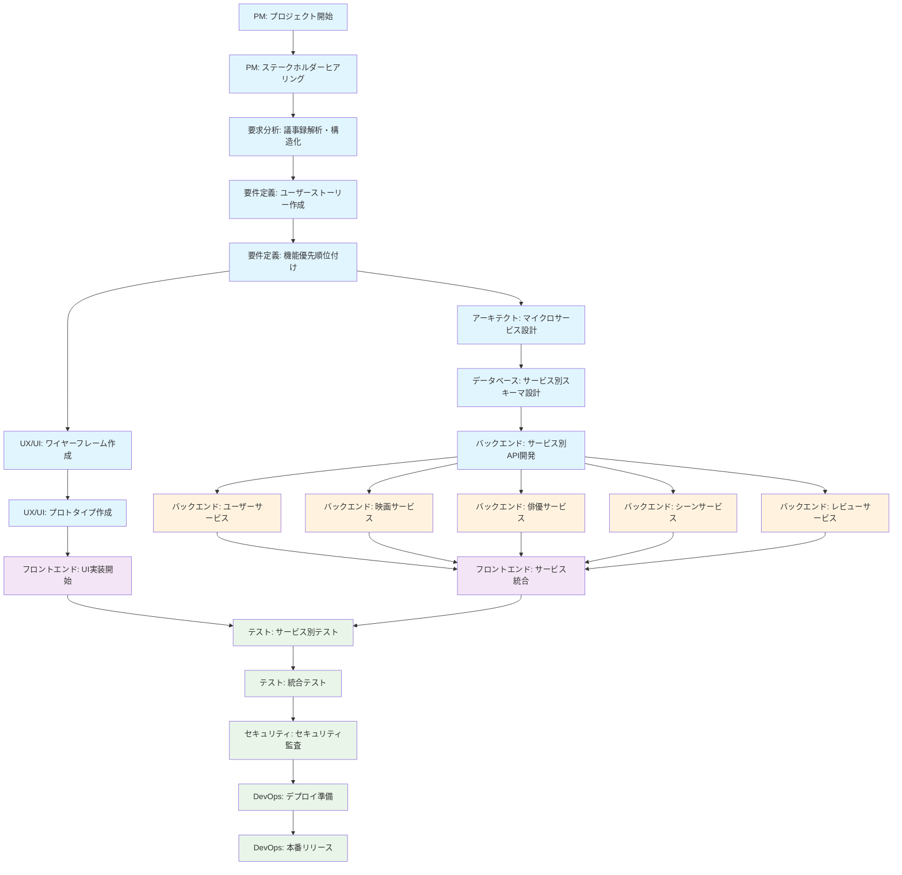
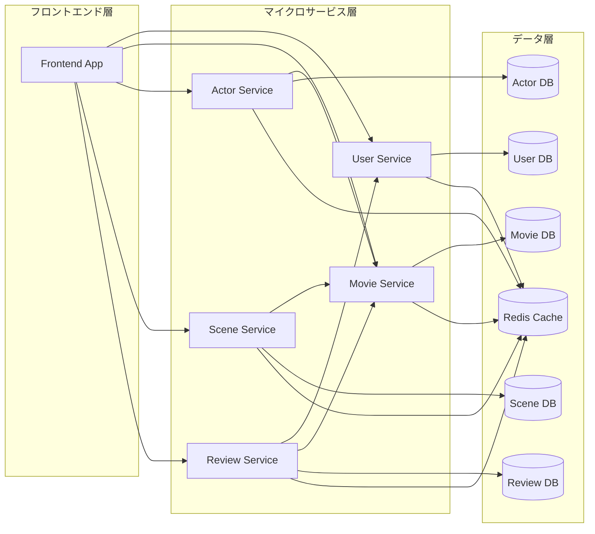

# プロジェクト憲章

## 映像作品・俳優データベースサービス

### プロジェクト概要

**プロジェクト名**: Cinecom
**開発期間**: 3ヶ月（MVP版）
**開発方式**: 複数AIエージェント協調開発
**アーキテクチャ**: マイクロサービス構成

### プロジェクトの目的

**主目的**: 映画・TV番組とそれに出演する俳優・スタッフの包括的なデータベースサービスを構築し、ユーザーが作品と人物、特定のシーン（戦闘、ロマンス、アクション等）を効率的に検索・発見できるWebアプリケーションを提供する

**成功指標**:

- **手動入力による100件以上の映像作品データ登録**
- **50件以上の映像作品にシーン情報付与（平均5シーン/作品）**
- 主要機能（検索・詳細表示・ユーザー評価・シーン検索）の実装完了
- レスポンス時間 < 500ms
- ユーザビリティテスト合格

### プロジェクトスコープ

#### **含まれるもの（In Scope）**

- 映像作品の基本情報管理（タイトル、配給日、ジャンル、あらすじ等）
- 俳優の人物情報管理
- 作品と人物の関連付け（キャスト情報）
- シーン管理機能（戦闘シーン、ロマンスシーン、アクションシーン等の分類・記録）
- 基本検索・フィルタリング機能
- ウォッチリスト・評価機能
- レスポンシブWebUI

#### **含まれないもの（Out of Scope）**

- 監督・スタッフ情報管理
- 動画ストリーミング機能
- チケット購入・予約システム
- ソーシャルメディア連携
- 多言語対応（英語・日本語のみ）
- モバイルアプリ
- 外部映画データAPI連携（TMDB等）
- 画像配信サービス（Cloudinary等）

### マイクロサービス構成

#### **サービス分割**

```yaml
user-service:
  責任: ユーザー管理・認証・プロフィール
  技術: NestJS + TypeScript
  データベース: PostgreSQL (users, profiles, auth_tokens)

movie-service:
  責任: 映画・TV番組データ管理
  技術: NestJS + TypeScript
  データベース: PostgreSQL (movies, genres)

actor-service:
  責任: 俳優・人物データ管理・キャスト関係
  技術: NestJS + TypeScript
  データベース: PostgreSQL (actors, cast_relations, filmography)

scene-service:
  責任: シーンデータ管理・分類
  技術: NestJS + TypeScript
  データベース: PostgreSQL (scenes, scene_categories, scene_tags)

review-service:
  責任: レビュー・評価・ウォッチリスト
  技術: NestJS + TypeScript
  データベース: PostgreSQL (reviews, ratings, watchlists)

frontend-app:
  責任: ユーザーインターフェース
  技術: Next.js 14+ with TypeScript
  API連携: 各マイクロサービスとの統合
```

### AIエージェント役割定義

#### **企画・設計系エージェント**

**要求分析エージェント**:

- **責任**: ステークホルダーヒアリング議事録の解析・構造化、要求事項の抽出・分類・整理、矛盾点・曖昧点・不足情報の特定、追加調査項目の洗い出し
- **成果物**: 要求分析書（docs/project/requirements_analysis.md）、矛盾点・課題整理表（docs/project/requirements_issues.md）、追加調査項目リスト（docs/project/additional_research.md）
- **権限**: 要求の分類・構造化方法の決定、議事録解析結果の判定
- **依存**: プロジェクト憲章、ステークホルダーヒアリング議事録
- **協調**: 要件定義エージェント（成果物引き渡し）、PMエージェント（追加調査承認）、アーキテクトエージェント（技術制約相談）
- **KPI**: 要求抽出完全性≥95%、分類精度≥90%、矛盾検出率≥85%、分析完了時間≤3営業日
- **Taskツールでの指示例**:
  - **基本要求分析**: `Task(subagent_type="requirements_analysis", description="ステークホルダー要求分析", prompt="docs/meetings/stakeholder_interviews/ ディレクトリ内のヒアリング議事録（初回・追加・補完調査含む）を分析し、要求分析書（docs/project/requirements_analysis.md）・矛盾点整理表（docs/project/requirements_issues.md）・追加調査項目リスト（docs/project/additional_research.md）を作成してください。プロジェクト憲章の制約条件も考慮してください。")`
  - **要件変更対応**: `Task(subagent_type="requirements_analysis", description="要件変更分析", prompt="docs/meetings/requirements_sessions/ 内の要件変更議事録を分析し、既存要求分析書への影響を評価して更新版を作成してください。変更内容と影響範囲を明確に記録してください。")`
  - **優先度分析**: `Task(subagent_type="requirements_analysis", description="要求優先度分析", prompt="要求分析書を基に各要求のビジネス価値・技術実現性・依存関係を評価し、MVP vs 将来拡張の初期分類を行ってください。")`
  - **技術整合性チェック**: `Task(subagent_type="requirements_analysis", description="技術制約適合性検証", prompt="要求分析結果を技術スタック（NestJS、Next.js、PostgreSQL、マイクロサービス構成）と照らし合わせ、実現困難な要求を特定し代替案を提示してください。")`

**要件定義エージェント**:

- **責任**: 要求分析書を基にした要件定義書・ユーザーストーリー作成、機能要件の詳細化・優先順位付け
- **成果物**: 要件定義書（docs/project/requirements.md）、ユーザーストーリー（docs/project/user_stories.md + GitHub Issues）
- **権限**: 機能優先順位の最終決定、要件仕様の確定
- **依存**: 要求分析エージェント（要求分析書、課題整理表、追加調査結果）
- **協調**: 要求分析エージェント（成果物受領・課題確認）、UX/UIデザインエージェント（ユーザー体験要件）、アーキテクトエージェント（技術制約確認）
- **KPI**: ユーザーストーリー完成度、要件変更回数≤3回、要件定義完了時間≤5営業日
- **ユーザーストーリー管理方針**:
  - **作成基準**: 要求分析書の機能要求を基に、INVEST原則に従ったストーリー作成
  - **重複防止**: 既存user_stories.mdとの照合、類似機能の統合判定
  - **新規作成**: user_stories.mdに追加 + 対応するGitHub Issue作成
  - **更新**: user_stories.mdを修正 + 未実装の場合は既存Issue更新、実装済みの場合は新Issue作成
  - **進捗管理**: GitHub Issuesをカンバンで視覚化して進捗追跡
- **Taskツールでの指示例**:
  - **要件定義書作成**: `Task(subagent_type="requirements_definition", description="要件定義書作成", prompt="要求分析書（docs/project/requirements_analysis.md）を基に、Cinecomプロジェクトの詳細な要件定義書を作成してください。機能要件・非機能要件・制約条件を明確に定義してください。")`
  - **ユーザーストーリー作成**: `Task(subagent_type="requirements_definition", description="ユーザーストーリー作成", prompt="要件定義書を基に、INVEST原則に従ったユーザーストーリーを作成し、重複チェックを行った上でdocs/project/user_stories.mdに保存してください。対応するGitHub Issuesも作成してください。")`
  - **優先順位確定**: `Task(subagent_type="requirements_definition", description="機能優先順位確定", prompt="要求分析書の初期優先度評価を基に、ビジネス価値・技術的依存関係・開発コストを考慮して最終的な機能優先順位を決定してください。")`

**UX/UIデザインエージェント**:

- **責任**: ユーザー体験設計、インターフェース設計
- **成果物**: ワイヤーフレーム、デザインシステム、プロトタイプ
- **権限**: UI/UX仕様の最終決定
- **承認プロセス**:
  - **Level 1**: デザイン詳細（色彩、フォント、コンポーネント仕様）→ 自律判断
  - **Level 2**: UI/UX仕様変更（ナビゲーション、画面遷移）→ 要件定義エージェント + プロジェクトマネージャー承認
  - **Level 3**: 根本的UX変更（ユーザーフロー大幅変更）→ 全体合意 + 人間承認
- **KPI**: デザイン一貫性スコア、ユーザビリティテスト結果
- **Taskツールでの指示例**:
  - **ワイヤーフレーム作成**: `Task(subagent_type="ux_ui_design", description="UI/UXワイヤーフレーム作成", prompt="Cinecomプロジェクトのユーザーストーリーに基づいて、映画・俳優検索、シーン管理機能のワイヤーフレームを作成してください。レスポンシブWebUIを考慮してください。")`
  - **プロトタイプ作成**: `Task(subagent_type="ux_ui_design", description="プロトタイプ作成", prompt="作成したワイヤーフレームを基に、インタラクティブなプロトタイプを作成してください。")`
  - **設計承認依頼**: PMエージェントがLevel 2以上の場合に人間承認プロセスを開始

**アーキテクトエージェント**:

- **責任**: システム全体設計、技術選定、マイクロサービス設計
- **成果物**: システム構成図、技術仕様書、サービス間API仕様
- **権限**: 技術スタック・アーキテクチャの決定
- **承認プロセス**:
  - **Level 1**: 技術選定詳細（フレームワークバージョン、ツール選定）→ 自律判断
  - **Level 2**: API仕様変更、データベーススキーマ変更 → 関連エージェント協議
  - **Level 3**: 技術スタック変更、アーキテクチャ根本変更 → 全体合意 + 人間承認
- **KPI**: システム設計品質、技術選定適合性
- **Taskツールでの指示例**:
  - **予備作業（並列実行可能）**: `Task(subagent_type="architect", description="技術スタック調査", prompt="映像・俳優データベースサービス用の技術スタック（NestJS、Next.js、PostgreSQL等）のベストプラクティス、マイクロサービス分割パターン、類似プロジェクト事例を調査し、技術選定の基礎資料を作成してください。")`
  - **詳細設計（要件定義後）**: `Task(subagent_type="architect", description="システムアーキテクチャ設計", prompt="要件定義書に基づいて、Cinecomプロジェクトのマイクロサービス構成を詳細設計してください。user-service、movie-service、actor-service、scene-service、review-serviceの技術スタック選定と相互連携を定義してください。")`
  - **API仕様設計**: `Task(subagent_type="architect", description="サービス間API仕様設計", prompt="システム設計に基づいて各マイクロサービス間のRESTful API仕様を設計し、docs/architecture/api_specification.mdに記録してください。")`

#### **開発系エージェント**

**フロントエンドエージェント**:

- **責任**: Next.js with TypeScriptベースのUI実装、フロントエンドパフォーマンス最適化
- **成果物**: Webアプリケーション（クライアントサイド）、ページパフォーマンス分析レポート
- **権限**: フロントエンド実装方法・UI最適化の決定
- **依存**: UX/UIデザインエージェント、バックエンドエージェント
- **協調**: DevOpsエージェント（システム全体パフォーマンス分析）
- **KPI**: ページロード時間、コードカバレッジ、ESLint準拠率
- **Taskツールでの指示例**:
  - **UI実装**: `Task(subagent_type="frontend", description="Next.js UI実装", prompt="UX/UIデザインのワイヤーフレームに基づいて、Next.js 14+ with TypeScriptでWebアプリケーションを実装してください。Tailwind CSS + HeadlessUIを使用し、レスポンシブ対応してください。")`
  - **API統合**: `Task(subagent_type="frontend", description="マイクロサービスAPI統合", prompt="バックエンドの各マイクロサービス（user-service、movie-service等）のAPIと統合し、フロントエンドからデータ取得・更新ができるようにしてください。")`
  - **パフォーマンス最適化**: PMエージェントが実装完了後に最適化タスクを発行

**バックエンドエージェント**:

- **責任**: NestJS with TypeScript + Express.jsベースのマイクロサービス実装、ビジネスロジック、APIパフォーマンス最適化
- **成果物**: マイクロサービス群、認証システム、API応答速度分析レポート
- **権限**: API実装仕様・バックエンド最適化の決定
- **依存**: アーキテクトエージェント、データベースエージェント
- **協調**: DevOpsエージェント（システム全体パフォーマンス分析）
- **KPI**: API応答時間、エラー率、コードカバレッジ
- **Taskツールでの指示例**:
  - **マイクロサービス実装**: `Task(subagent_type="backend", description="マイクロサービス実装", prompt="アーキテクト設計とDB設計に基づいて、NestJS + TypeScriptで以下のマイクロサービスを実装してください: user-service、movie-service、actor-service、scene-service、review-service。各サービスのRESTful APIとビジネスロジックを含めてください。")`
  - **サービス間認証**: `Task(subagent_type="backend", description="サービス間認証構築", prompt="JWT + OAuth2を使用してマイクロサービス間の認証システムを構築してください。セキュリティ要件に従って実装してください。")`
  - **API最適化**: PMエージェントが基本実装完了後にパフォーマンス最適化タスクを発行

**データベースエージェント**:

- **責任**: データモデル設計、パフォーマンス最適化、データベース固有の性能分析
- **成果物**: PostgreSQLデータベーススキーマ、TypeORMエンティティ、マイグレーション、クエリ最適化レポート
- **権限**: データベース構造・クエリパフォーマンス改善の決定
- **依存**: アーキテクトエージェント
- **協調**: DevOpsエージェント（システム全体パフォーマンス分析）
- **KPI**: クエリ実行時間、データ整合性、インデックス効率
- **Taskツールでの指示例**:
  - **予備作業（並列実行可能）**: `Task(subagent_type="database", description="DB技術調査", prompt="マイクロサービス用PostgreSQL設計のベストプラクティス、TypeORM活用法、データベース分割パターン、サービス間データ整合性確保手法を調査し、DB技術選定の基礎資料を作成してください。")`
  - **詳細設計（システム設計後）**: `Task(subagent_type="database", description="マイクロサービス用DB設計", prompt="システム設計とAPI仕様に基づいて、PostgreSQL 15+でサービス別データベーススキーマを設計してください。user-service、movie-service、actor-service、scene-service、review-service用のスキーマとTypeORMエンティティを作成してください。")`
  - **マイグレーション作成**: `Task(subagent_type="database", description="データベースマイグレーション作成", prompt="設計したスキーマに基づいてTypeORMマイグレーションファイルを作成し、データベース環境をセットアップしてください。")`
  - **パフォーマンス最適化**: PMエージェントが基本実装完了後にクエリ最適化タスクを発行

#### **品質保証系エージェント**

**テストエージェント**:

- **責任**: テストケース作成・実行、品質担保、マイクロサービス統合テスト
- **成果物**: テストスイート、テストレポート、統合テスト結果
- **権限**: テスト合格基準の設定
- **KPI**: テストカバレッジ、バグ検出率、テスト実行時間
- **Taskツールでの指示例**:
  - **テストスイート作成**: `Task(subagent_type="test", description="マイクロサービステスト作成", prompt="各マイクロサービスの単体テスト、統合テスト、E2Eテストスイートを作成してください。Jest + React Testing Libraryを使用し、80%以上のカバレッジを達成してください。")`
  - **テスト実行・分析**: `Task(subagent_type="test", description="テスト実行・カバレッジ分析", prompt="作成したテストスイートを実行し、カバレッジ分析を行ってレポートを作成してください。")`
  - **次フェーズ連携**: PMエージェントがテスト完了後にセキュリティエージェントへTaskを発行

**セキュリティエージェント**:

- **責任**: セキュリティ監査、脆弱性検査、マイクロサービス間通信セキュリティ
- **成果物**: セキュリティチェックリスト、監査レポート
- **権限**: セキュリティ要件の設定
- **KPI**: 脆弱性スコア、セキュリティテスト合格率
- **Taskツールでの指示例**:
  - **セキュリティ監査**: `Task(subagent_type="security", description="マイクロサービスセキュリティ監査", prompt="OWASP Top 10に基づいて全マイクロサービスのセキュリティ監査を実行してください。脆弱性スキャン、サービス間認証検証、API セキュリティ検証を含めてください。")`
  - **セキュリティ強化**: `Task(subagent_type="security", description="セキュリティ強化実装", prompt="監査結果に基づいてセキュリティ強化策を実装し、個人情報暗号化とデータ保護を確保してください。")`
  - **次フェーズ連携**: PMエージェントがセキュリティ要件達成後にDevOpsエージェントへTaskを発行

#### **運用系エージェント**

**DevOpsエージェント**:

- **責任**: CI/CD構築、インフラ管理、GitHub環境設定、Claude Code協調システム運用、システムパフォーマンス分析・監視、マイクロサービスデプロイ管理
- **成果物**: デプロイパイプライン（Vercel + Render）、インフラコード、GitHub設定（CODEOWNERS、Webhooks、Actions）、Claude Code協調環境、Sentry統合、パフォーマンス分析レポート
- **権限**: デプロイ方法・インフラ構成・Claude Code協調環境・パフォーマンス改善施策の決定
- **KPI**: デプロイ成功率、システム稼働率、エージェント応答時間
- **Taskツールでの指示例**:
  - **CI/CD構築**: `Task(subagent_type="devops", description="マイクロサービス用CI/CD構築", prompt="GitHub ActionsでマイクロサービスのCI/CDパイプラインを構築してください。サービス別のステージングデプロイ、プロダクトタグベース本番デプロイを設定してください。")`
  - **デプロイ環境構築**: `Task(subagent_type="devops", description="デプロイ環境構築", prompt="Vercel (Frontend) + Render (Backend Services)でデプロイ環境を構築し、システム監視とSentry統合を設定してください。")`
  - **パフォーマンス分析**: PMエージェントが全体実装完了後にシステム最適化タスクを発行

**プロジェクトマネージャーエージェント**:

- **責任**: 全体進捗管理、課題調整、合意形成プロセス運用、設計承認、リリース管理
- **成果物**: 進捗レポート、課題管理表、承認記録、リリース計画
- **権限**: スケジュール調整、優先順位変更、Level 1-2の承認、UX/UI設計承認、リリース承認
- **依存**: DevOpsエージェント（GitHub設定・運用）
- **KPI**: 進捗達成率、課題解決時間、エージェント稼働率、承認処理時間
- **Claude Code協調システムでの役割**:
  - **TodoWrite管理**: 全体進捗をTodoWriteで可視化・追跡
  - **並列Task実行**: 複数エージェントへの並列Task発行で効率的な協調
  - **進捗調整**: エージェント完了報告を受けて次フェーズのTask発行
  - **承認プロセス**: Level 2以上の設計変更時に人間承認プロセスを開始
  - **課題管理**: ブロッカー発生時の代替案検討とエスカレーション
- **Taskツール活用例**:
  - **フェーズ開始**: `Task(subagent_type="requirements_definition", description="要件定義", prompt="プロジェクト憲章に基づいてCinecomの要件定義を作成...")`と同時に複数エージェントへ並列発行
  - **進捗管理**: TodoWriteで各フェーズの状況を追跡し、完了したタスクから次のタスクを動的に発行
  - **品質管理**: 各エージェントの成果物レビューと品質基準達成の確認
- **人間レビュー待ち受けプロセス**:
  - **レビュー依頼**: Level 2以上の成果物完了時に人間レビューを依頼し、TodoWriteで「人間レビュー待ち」状態を記録
  - **並行作業継続**: レビュー待ち中も他の並行可能なタスクを継続実行
  - **フィードバック処理**:
    - **承認 (Yes)**: 次フェーズのTaskを自動発行
    - **修正依頼 (No + 指摘)**: 指摘内容を基に該当エージェントへ修正Taskを自動発行
    - **保留**: 追加情報待ちとしてTodoWriteで状態管理
- **セッション継続性管理**:
  - **状態保存**: `.agents/state/pm-session.json`でレビュー待ち状態、進行中タスク、依存関係を保存
  - **自動復旧**: ターミナル再起動時に保存状態から自動復旧し、レビュー待ちを継続
  - **手動再開**: `/resume_review`コマンドでレビュー待ち状態を確認・再開
- **レビュー履歴記録システム**:
  - **記録場所**: 複数箇所での記録によるトレーサビリティ確保
    - **docs/project/review_history.md**: 人間レビューの履歴・判断根拠・指摘内容の構造化記録
    - **.agents/reviews/human-review-log.json**: システム処理用の機械読取可能なレビューログ
    - **GitHub Issues**: レビュー結果に基づく修正タスクや新要件の追跡
  - **記録項目**:

    ```yaml
    レビュー記録フォーマット:
      timestamp: "2025-08-21T14:30:00Z"
      review_id: "review-20250821-001"
      target: "ユーザーストーリー v1.2"
      reviewer: "human"
      agent_requestor: "pm-agent"
      decision: "修正依頼" # 承認/修正依頼/保留
      feedback: "シーン検索機能の詳細仕様が不明確"
      action_taken: "requirements-agentに詳細仕様作成を依頼"
      follow_up_task: "Task(subagent_type='requirements', ...)"
      session_state: "継続中"
    ```

  - **監査証跡の維持**:
    - **意思決定プロセス**: 各レビューでの判断理由・根拠の記録
    - **修正内容追跡**: 指摘事項に対する具体的な修正内容の記録
    - **品質改善サイクル**: レビューフィードバックから学習した改善点の蓄積

### 技術スタック

プロジェクトで採用する技術スタックは、マイクロサービス構成と開発効率を重視して選定されています。

#### **基本構成**

- **フロントエンド**: Next.js 14+ with TypeScript + Tailwind CSS
- **バックエンド**: NestJS with TypeScript + Express.js (マイクロサービス構成)
- **データベース**: PostgreSQL 15+ (サービス別DB) + Redis (キャッシュ)
- **インフラ**: Docker + GitHub Actions + Vercel/Render
- **認証**: JWT + OAuth2 (Google/GitHub)

#### **マイクロサービス構成**

5つのバックエンドサービス (user-service, movie-service, actor-service, scene-service, review-service) + フロントエンドアプリケーションで構成されています。

**詳細**: `/docs/architecture/technology_stack.md` - 完全な技術スタック仕様と選定理由

### Git戦略・デプロイフロー

マイクロサービス構成に最適化されたGitHub Flowベースの開発・デプロイフローを採用しています。

#### **基本ブランチ戦略**

- **main**: 本番デプロイ対象ブランチ（常にデプロイ可能状態）
- **feature/***: 機能開発ブランチ（エージェント別・機能別）
- **hotfix/***: 緊急修正ブランチ

#### **環境別デプロイフロー**

1. **開発環境**: feature/* ブランチ → ブランチ別並行デプロイ（個別機能確認）
2. **ステージング環境**: main ブランチ → サービス単位継続的デプロイ（統合テスト）
3. **本番環境**: プロダクトタグ → 全サービス一括デプロイ（リリース）

#### **CI/CD パイプライン**

GitHub Actionsによる変更検出ベースのCI/CD、サービス別並列ビルド・テスト、環境別自動デプロイを実現しています。

**詳細**:

- `/docs/development/git_workflow.md` - Git戦略・ブランチ運用詳細
- `/docs/development/ci_cd_pipeline.md` - CI/CDパイプライン設計・実装

### AI エージェント協調における意思決定

単一GitHubアカウントでのAIエージェント協調では、従来の権限ベース意思決定は適用できません。代替として、協調ベースの意思決定プロセスを採用します。

#### **協調意思決定レベル**

- **Level 0**: 人間の最終判断（プロジェクト方向性・ビジネス要件）
- **Level 1**: 単一エージェント判断（専門領域内の実装詳細）
- **Level 2**: 複数エージェント協調（影響範囲が複数領域にわたる変更）
- **Level 3**: 全体調整 + 人間承認（アーキテクチャ変更等の根本的変更）

#### **エージェント責任原則**

**基本方針**: 「責任領域は独立、作業進行は協調」

**独立責任領域**:
- 各エージェントは自分の専門分野での判断・実装・成果物作成に完全な責任を持つ
- 専門知識に基づく技術的判断は他エージェントの承認を必要としない
- 品質基準・コーディング規約・セキュリティガイドラインの遵守責任

**協調作業進行**:
- 複数領域に影響する変更は事前の協議・合意が必要
- 他エージェントの成果物に依存する作業は進捗・仕様の確認が必要
- プロジェクト全体の整合性確保のための情報共有・調整

#### **実際の協調プロセス**

```yaml
技術的制約:
  - 全エージェントが同一GitHubアカウントで動作
  - 実際の権限分離は不可能
  - GitHub上での承認プロセスは機能しない

代替協調手法:
  1. ドキュメントベースでの役割分担明記
  2. ブランチ命名規則でのエージェント識別
  3. コミットメッセージでの担当エージェント明記
  4. プルリクエストテンプレートでの自己チェック
  5. 自動化ツール（CI/CD, SonarCloud）での品質管理
```

#### **協調フロー（単一アカウント版）**

1. **提案・記録**: GitHub Issue/PR作成で変更提案
2. **エージェント識別**: ブランチ名・コミットメッセージで担当明記
3. **自動品質チェック**: CI/CD・SonarCloudによる品質ゲート
4. **自己レビュー**: PRテンプレートのチェックリスト実行
5. **実装・統合**: 自動テスト通過後のマージ・デプロイ

#### **品質管理システム（自動化重視）**

人間によるレビューを代替する自動化システム:

```yaml
自動品質管理:
  CI/CD Pipeline:
    - Lint, TypeScript, Test の自動実行
    - セキュリティスキャン（pnpm audit）
    - ビルド・デプロイ検証

  SonarCloud品質ゲート:
    - コード品質スコア
    - セキュリティホットスポット
    - 技術的負債測定
    - カバレッジ最低基準

  自動依存関係管理:
    - Dependabot脆弱性監視
    - 依存関係更新PR自動作成

利点:
  - 24/7の品質監視
  - 人的ミス排除
  - 一貫した基準適用
  - 高速フィードバックループ
```

#### **エージェント協調システム**

Claude CodeのTodoWrite + Taskツールを基盤とした効率的な協調システムを構築しています。

**基本構造**:

- **プロジェクトマネージャー**: TodoWriteで全体管理、Taskで作業分散
- **専門エージェント**: Taskツールで起動、専門分野での作業実行
- **協調メカニズム**: GitHub PR/Issues + Discord通知

**協調フロー**: 要求分析 → 要件定義 → 技術調査（並列） → 詳細設計（順次） → 実装（並列）

**Claude Code協調の特徴**:

- シンプルで可視化しやすい進捗管理
- 複雑なメッセージングシステム不要
- 自動的な依存関係解決

**詳細**: `/docs/agents/coordination_protocols.md` - エージェント間協調の詳細プロトコル

### 開発フェーズ

#### **Phase 1: プロジェクト基盤構築（Week 1-2）**

**目標**: 開発環境とチーム協調システム確立

**Week 1**:

- [ ] GitHubリポジトリセットアップ（DevOps）
- [ ] Claude Code協調システム運用開始（DevOps）
- [ ] ステークホルダーヒアリング実施（PM + 人間）
- [ ] 要求分析・構造化（要求分析エージェント）
- [ ] 要件定義・ユーザーストーリー作成（要件定義）
- [ ] マイクロサービスアーキテクチャ設計（アーキテクト）

**Week 2**:

- [ ] UI/UXワイヤーフレーム作成（UX/UI）
- [ ] サービス別データベーススキーマ設計（データベース）
- [ ] サービス間API仕様定義（バックエンド + アーキテクト）
- [ ] マイクロサービス用開発環境セットアップ（全エージェント）

**成果物**:

- プロジェクト基盤ドキュメント一式
- Claude Code協調システム運用環境
- マイクロサービス基盤構成
- サービス別開発環境

#### **Phase 2: コア機能実装（Week 3-8）**

**目標**: MVPの主要機能実装完了

**Week 3-4: 認証・基盤サービス**:

- [ ] ユーザーサービス実装（バックエンド + データベース）
- [ ] サービス間認証システム（バックエンド + セキュリティ）
- [ ] 基本的なUI コンポーネント（フロントエンド）
- [ ] マイクロサービス基盤構築（DevOps）

**Week 5-6: 映画・俳優・シーンデータサービス**:

- [ ] 映画サービス実装（バックエンド + データベース）
- [ ] 俳優サービス実装（バックエンド + データベース）
- [ ] シーンサービス実装（バックエンド + データベース）
- [ ] **シーン分類システム実装（戦闘、ロマンス、アクション等）**
- [ ] 映画・俳優・シーン検索UI（フロントエンド）
- [ ] **シーン管理・検索機能（フロントエンド + バックエンド）**
- [ ] サービス間連携テスト（テスト）

**Week 7-8: レビュー機能・統合**:

- [ ] レビューサービス実装（バックエンド + データベース）
- [ ] ウォッチリスト機能（フロントエンド + バックエンド）
- [ ] **シーンベース検索・推薦機能（「アクションシーンが多い映画」等）**
- [ ] マイクロサービス統合・最適化（全エージェント）
- [ ] 包括的テストスイート（テスト）
- [ ] セキュリティ監査（セキュリティ）

**成果物**:

- 動作するマイクロサービス群（5サービス + フロントエンド）
- **手動入力による100件以上の映画データ**
- **50件以上の作品にシーン分類データ（平均5シーン/作品）**
- サービス間統合テスト完了

#### **Phase 3: 品質向上・デプロイ（Week 9-12）**

**目標**: プロダクション準備とリリース

**Week 9-10: 品質向上**:

- [ ] 包括的テスト実装（テスト）
- [ ] マイクロサービスパフォーマンス最適化（DevOps + 各エージェント）
- [ ] セキュリティ強化（セキュリティ）
- [ ] UI/UX改善（UX/UI + フロントエンド）

**Week 11-12: デプロイ・運用準備**:

- [ ] プロダクション環境構築（DevOps）
- [ ] マイクロサービス用CI/CDパイプライン完成（DevOps）
- [ ] サービス監視・ログシステム（DevOps）
- [ ] ドキュメント整備（全エージェント）

**成果物**:

- プロダクション稼働可能なマイクロサービスアプリケーション（5サービス + フロントエンド）
- 運用ドキュメント
- プロジェクト完了レポート

### コミュニケーションルール

#### **Claude Code協調システム**

- **TodoWrite管理**: プロジェクトマネージャーによる全体進捗管理
- **並列Task実行**: 複数の専門エージェントによる並列作業
- **GitHub統合**: Issues/PRベースでの進捗追跡・レビュー
- **Discord統合**: リアルタイム通知・進捗共有（オプション）
- **定期レビュー**: フェーズ完了時の成果物レビュー
- **週次レビュー**: 日曜夜に全体進捗・課題分析

#### **通知システム設計原則**

**Claude Code協調システムでの監査証跡**:

```yaml
設計方針: GitHub + Claude Code + Discord（オプション）
目的: シンプルで追跡可能な協調システム

GitHub統合:
  役割: 成果物管理・レビュー・進捗追跡
  記録内容:
    - コード・ドキュメント変更履歴
    - Issues/PRでのタスク管理
    - レビューコメント・意思決定過程
    - CI/CDによる自動テスト結果

Claude Code TodoWrite:
  役割: 全体進捗管理・タスク分散
  記録内容:
    - フェーズ別タスク状況
    - 完了・進行中・ペンディング状態
    - エージェント間の依存関係
    - 課題・ブロッカーの可視化

Discord通知（オプション）:
  役割: リアルタイム通知・チーム状況共有
  記録内容:
    - 重要な進捗通知
    - 緊急事態・エスカレーション
    - フェーズ完了通知
```

#### **ドキュメント管理（Claude Code協調環境）**

- **Single Source of Truth**: GitHubリポジトリを情報集約先とする
- **バージョン管理**: 全ドキュメント・コードにGitバージョン管理
- **TaskWrite管理**: エージェント間でのタスク・進捗情報共有
- **GitHub統合**: Issues/PRによる作業追跡とレビュープロセス
- **協調レビュー**: エージェント間でのコードレビュー・承認プロセス
- **CODEOWNERS活用**: GitHubプルリクエスト時の自動レビュアーアサイン

#### **ログ・監査システム**

```bash
# 完全な監査証跡のためのログ構成
.agents/logs/
├── coordination.log          # エージェント間協調ログ
├── deployment.log           # デプロイメント履歴
├── performance.log          # パフォーマンス監視
├── communication/
│   ├── discord-history.json    # Discord通知履歴
│   ├── tmux-commands.log       # tmuxコマンド実行履歴
│   ├── file-operations.log    # ファイル操作履歴
│   └── review-timeline.json   # レビュープロセス詳細履歴
├── errors/
│   ├── agent-errors.log       # エージェントエラー履歴
│   ├── system-failures.log    # システム障害履歴
│   └── communication-failures.log # 通信障害履歴
└── audit/
    ├── decision-history.json  # 意思決定履歴
    ├── escalation-log.json   # エスカレーション履歴
    └── human-interventions.log # 人間介入履歴

# ログ分析・問題究明用コマンド
./analyze_logs.sh <start_date> <end_date> <incident_type>
./trace_communication.sh <pr_number> <agent_name>
./generate_audit_report.sh <date_range>
```

#### **課題・ブロッカー対応**

- **即座にエスカレーション**: 24時間以内に解決できない課題
- **影響度評価**: Critical/High/Medium/Lowで分類
- **代替案検討**: ブロッカー発生時は並行して代替案検討
- **自動リカバリ**: 可能な限り自動的な代替手段実行
- **Discord緊急通知**: 重要度Criticalの即座通知
- **レビュー期限管理**: 24時間以内のレビュー完了目標・期限切れ自動警告

### 品質基準・リスク管理・モニタリング

運用・品質管理に関する詳細な基準・プロセスは専門ドキュメントで管理されています。

#### **品質基準概要**

- **コード品質**: テストカバレッジ80%以上、ESLint/Prettier準拠
- **パフォーマンス**: API応答時間500ms以下、ページロード2秒以内
- **セキュリティ**: OWASP Top 10対策、JWT + OAuth2認証

#### **リスク管理概要**

- **技術リスク**: サービス間依存・データ整合性・スケーラビリティ
- **協調リスク**: エージェント間通信・プロセス運用・システム障害
- **人的リスク**: レビュー遅延・仕様変更・知識ギャップ

#### **モニタリング概要**

- **開発進捗**: スプリント達成率・コミット頻度・PR処理時間
- **システム品質**: バグ発生率・テスト実行時間・ビルド成功率
- **協調システム**: エージェント応答時間・通知成功率・レビュー完了率

**詳細**:

- `/docs/operations/quality_standards.md` - 詳細な品質基準・定義・測定方法
- `/docs/operations/risk_management.md` - リスク分析・対策・監視プロセス  
- `/docs/operations/monitoring_metrics.md` - 監視指標・アラート・分析手法

### 成功基準

#### **機能要件達成**

- [ ] 映画検索・詳細表示機能
- [ ] 俳優プロフィール・フィルモグラフィー表示
- [ ] **シーン管理機能（登録・編集・検索・フィルタリング）**
- [ ] **シーン分類システム（戦闘、ロマンス、アクション、コメディ等）**
- [ ] ユーザー登録・ウォッチリスト機能
- [ ] レスポンシブUI実装
- [ ] 評価・レビューシステム
- [ ] マイクロサービス間連携機能

#### **非機能要件達成**

- [ ] **手動入力による100件以上の映像作品データ登録**
- [ ] **50件以上の作品にシーン情報付与（戦闘、ロマンス、アクション等）**
- [ ] API応答時間500ms以下
- [ ] セキュリティ要件満足
- [ ] 99.9%稼働率達成
- [ ] マイクロサービス個別デプロイ可能

#### **協調開発成功**

- [ ] 全エージェントが定められた役割を完遂
- [ ] 重大な設計変更なく開発完了
- [ ] 品質基準をクリア
- [ ] エージェント協調システムの安定運用
- [ ] Discord連携システムの効果的運用

#### **ビジネス目標達成**

- [ ] ユーザビリティテスト合格
- [ ] パフォーマンステスト合格
- [ ] セキュリティ監査通過
- [ ] 運用保守ドキュメント完備
- [ ] マイクロサービス運用体制確立

### エージェント間ワークフロー自動化

#### **開発フロー全体図**



#### **マイクロサービス依存関係図**



### 緊急時対応プロトコル

プロジェクトにおける緊急事態（システム障害、エージェント障害、データ損失等）への迅速な対応体制を確立しています。

#### **緊急事態の分類**

- **Critical**: システム全体停止・データ損失（30分以内対応）
- **High**: 単一サービス障害・開発ブロッカー（4時間以内対応）
- **Medium**: 軽微な機能不全・パフォーマンス問題（24時間以内対応）

#### **基本対応フロー**

1. **即座検出・通知**: 自動監視 + 手動報告 → Discord緊急通知
2. **影響評価**: 障害範囲・重要度の迅速な判定
3. **初期対応**: 自動復旧・一時的な代替手段の起動
4. **本格復旧**: 根本原因分析・完全復旧の実施
5. **事後改善**: 再発防止策・プロセス改善の実装

**詳細**: `/docs/agents/emergency_procedures.md` - 具体的な障害対応手順と復旧プロセス

### ドキュメント管理体系

#### **必須ドキュメント**

```bash
docs/
├── project/
│   ├── charter.md (本憲章)
│   ├── requirements_analysis.md (要求分析書)
│   ├── requirements_issues.md (矛盾点・課題整理表)
│   ├── additional_research.md (追加調査項目リスト)
│   ├── requirements.md (要件定義書)
│   ├── user_stories.md (ユーザーストーリー)
│   └── project_plan.md
├── meetings/
│   ├── stakeholder_interviews/    # ステークホルダーヒアリング
│   │   ├── 2025-08-22_initial_interview.md
│   │   ├── 2025-08-25_follow_up_interview.md
│   │   ├── 2025-08-28_technical_requirements.md
│   │   └── template_interview.md  # ヒアリング議事録テンプレート
│   ├── requirements_sessions/     # 要件確認・変更会議
│   │   ├── 2025-08-26_requirements_review.md
│   │   ├── 2025-09-02_requirements_change.md
│   │   └── template_requirements.md
│   ├── project_meetings/          # プロジェクト定例会議
│   │   ├── 2025-08-22_kickoff.md
│   │   └── weekly_review/
│   │       ├── 2025-08-28_week1_review.md
│   │       └── template_weekly.md
│   └── research_sessions/         # 追加調査・分析会議
│       ├── 2025-08-27_competitive_analysis.md
│       ├── 2025-08-30_technical_feasibility.md
│       └── template_research.md
├── architecture/
│   ├── system_design.md
│   ├── microservices_design.md
│   ├── api_specification.md
│   ├── database_schema.md
│   └── security_design.md
├── development/
│   ├── setup_guide.md
│   ├── coding_standards.md
│   ├── git_workflow.md
│   ├── microservices_development.md
│   └── testing_strategy.md
├── operations/
│   ├── deployment_guide.md
│   ├── monitoring_setup.md
│   ├── backup_strategy.md
│   └── troubleshooting.md
└── agents/
    ├── coordination_protocols.md (エージェント間協調プロトコル)
    ├── agent_responsibilities.md
    ├── discord_integration.md
    └── emergency_procedures.md

.claude/
└── agents/
    ├── requirements_analysis.md     # Claude Codeサブエージェント定義
    ├── requirements_definition.md
    ├── ux_ui_design.md
    ├── architect.md
    ├── frontend.md
    ├── backend.md
    ├── database.md
    ├── test.md
    ├── security.md
    ├── devops.md
    └── project_manager.md
```

#### **ドキュメント更新ルール**

- **即座更新**: API仕様、データベーススキーマ変更
- **毎日更新**: 進捗レポート、課題管理
- **週次更新**: アーキテクチャドキュメント、運用手順
- **フェーズ終了時**: 全体的なドキュメント見直し
- **Discord自動通知**: 重要ドキュメント更新時

#### **議事録管理ルール**

**ファイル命名規則**:

- **フォーマット**: `YYYY-MM-DD_<会議種別>_<補足説明>.md`
- **例**: `2025-08-22_initial_stakeholder_interview.md`, `2025-08-25_requirements_change_session.md`

**保存場所別管理**:

- **stakeholder_interviews/**: 初回ヒアリング、追加ヒアリング、補完調査
- **requirements_sessions/**: 要件確認、要件変更、仕様調整会議
- **research_sessions/**: 競合分析、技術調査、市場調査
- **project_meetings/**: キックオフ、定例会議、レビュー会議

**議事録必須項目**:

- 日時・参加者・議題
- 要求・要件に関する発言の構造化記録
- 決定事項・保留事項・次回アクション
- 要求分析エージェントが参照しやすい形式での記録

**更新・追記ルール**:

- **即座作成**: 会議終了後24時間以内
- **追記**: 補足情報があれば既存ファイルに日付付きで追記
- **要件変更**: 新規ファイル作成 + 関連する過去議事録への参照リンク追加
- **要求分析エージェント通知**: 新規議事録作成時はPMエージェント経由で通知

#### **学習・改善メカニズム**

#### **エージェントパフォーマンス向上**

- **日次レビュー**: 各エージェントの作業効率・品質分析
- **週次改善**: ボトルネック特定・プロセス最適化
- **知識蓄積**: よくある課題・解決策のナレッジベース構築
- **ベストプラクティス共有**: 成功パターンの横展開
- **マイクロサービス固有学習**: サービス分割・連携のノウハウ蓄積
- **監査ログ分析**: 通信パターン・問題発生パターンの分析

#### **協調システム最適化**

- **通信パターン分析**: エージェント間の連携効率測定
- **自動化推進**: 繰り返し作業の自動化識別・実装
- **予測機能**: 過去データから課題・リスク予測
- **適応的調整**: プロジェクト進捗に応じた協調ルール調整
- **Discord統合最適化**: 通知効率・情報共有の改善
- **監査証跡活用**: 過去の意思決定・問題解決プロセスからの学習

#### **問題究明・改善プロセス**

```bash
# インシデント発生時の調査フロー
./investigate_incident.sh <incident_id> <start_time> <end_time>

# 調査対象ログ
1. Discord履歴: エージェント間の対話・意思決定過程
2. tmuxコマンドログ: 実際の処理実行履歴
3. ファイル操作ログ: システム状態変更の詳細
4. GitHub履歴: コード・ドキュメント変更との関連

# 改善提案生成
./generate_improvement_suggestions.sh <analysis_period>
# → 通信効率化、自動化機会、リスク軽減策を提案
```

### プロジェクト完了条件

#### **最終成果物チェックリスト**

**技術成果物**:

- [ ] 動作するマイクロサービスアプリケーション（フロントエンド + 5つのバックエンドサービス）
- [ ] サービス別データベース（100件以上の映画データ含む）
- [ ] マイクロサービス用CI/CDパイプライン
- [ ] サービス別テストスイート（80%以上カバレッジ）
- [ ] セキュリティ監査レポート
- [ ] パフォーマンステスト結果（サービス別）

**ドキュメント成果物**:

- [ ] ユーザーマニュアル
- [ ] 技術ドキュメント一式（マイクロサービス構成含む）
- [ ] 運用保守マニュアル（サービス別）
- [ ] プロジェクト完了レポート
- [ ] エージェント協調システム運用実績
- [ ] Discord連携システム運用実績

**品質確認**:

- [ ] 全機能テスト合格
- [ ] サービス間統合テスト合格
- [ ] パフォーマンス要件達成
- [ ] セキュリティ要件達成
- [ ] ユーザビリティテスト合格
- [ ] 運用稼働確認（マイクロサービス個別）

#### **プロジェクト終了プロセス**

1. **最終テスト実行**: 全エージェントによる包括テスト
2. **成果物レビュー**: 人間による最終確認
3. **知見整理**: プロジェクト全体の学習事項まとめ
4. **移行準備**: 運用チームへの引き継ぎ準備
5. **プロジェクト終了**: 正式なプロジェクト完了宣言

### 次期プロジェクトへの展開

#### **エージェント協調システムの再利用**

- **テンプレート化**: 今回のシステムを他プロジェクト用にテンプレート化
- **改善反映**: 今回の学習事項を次期システムに反映
- **スケール対応**: より大規模なプロジェクトでの協調システム設計
- **Discord統合ノウハウ**: 効果的な通知・協調パターンの横展開

#### **マイクロサービス開発ノウハウ**

- **サービス分割パターン**: 効果的なマイクロサービス分割方法
- **エージェント協調パターン**: 分散開発での効率的な協調方法
- **CI/CD最適化**: マイクロサービス用デプロイパイプライン

#### **知識・経験の蓄積**

- **ベストプラクティス集**: 各エージェントの効果的な作業パターン
- **課題・解決策DB**: 発生した問題と解決方法のデータベース
- **協調パターン**: 効果的なエージェント間協調パターンの体系化
- **Discord活用法**: プロジェクト管理・チーム協調でのDiscord活用ノウハウ

---

**承認**: 全エージェントがこの憲章に同意することで、協調開発を開始します。

**バージョン**: 2.1
**作成日**: 2025年8月21日
**更新日**: 2025年8月22日 (要求分析エージェント追加)
**次回レビュー**: フェーズ1完了時（Week 2終了時）

**主要更新内容**:

- **要求分析エージェントの追加** (v2.1)
- 要件定義プロセスの明確化・構造化
- エージェント間協調フローの最適化
- マイクロサービス構成の追加 (v2.0)
- Discord通知システムの統合 (v2.0)
- GitHub Flow + 環境別デプロイ戦略 (v2.0)

**憲章承認者**:

- [ ] 人間（プロジェクトオーナー）
- [ ] プロジェクトマネージャーエージェント
- [ ] 要求分析エージェント
- [ ] 要件定義エージェント
- [ ] アーキテクトエージェント
- [ ] DevOpsエージェント
- [ ] その他全エージェント

**重要事項**:

- 本憲章は生きた文書として、プロジェクト進行中に必要に応じて更新される
- 重要な変更は全エージェントの合意と人間の承認が必要
- Claude Code協調システムの効率的運用が本プロジェクトの成功の鍵
- マイクロサービス構成による分散開発の効率性が重要な成功要因

**開始条件**:

1. GitHubリポジトリのセットアップ完了（マイクロサービス構成対応）
2. Claude Code協調環境の確認完了
3. Discord連携システムの設定完了（オプション）
4. CODEOWNERS設定完了
5. TodoWrite + Taskツールの動作確認完了
6. 人間による最終承認

**連絡先**:

- プロジェクトオーナー: [設定要]
- 緊急時エスカレーション: [設定要]
- Discord: #cinecom-urgent (緊急), #cinecom-general (一般)
- 技術サポート: DevOpsエージェント経由

---

**バージョン**: 1.0
**作成日**: 2025年8月21日
**次回レビュー**: フェーズ1完了時（Week 2終了時）
