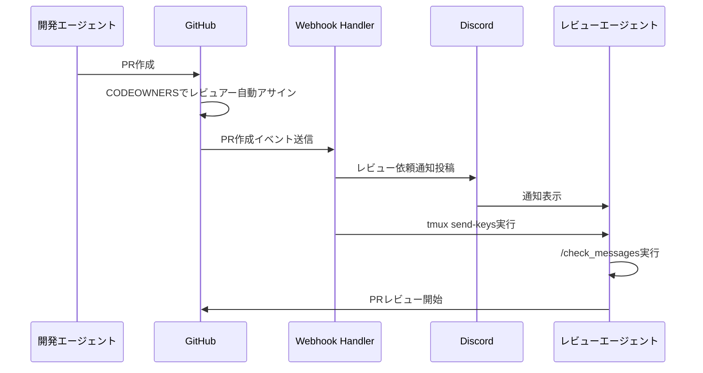
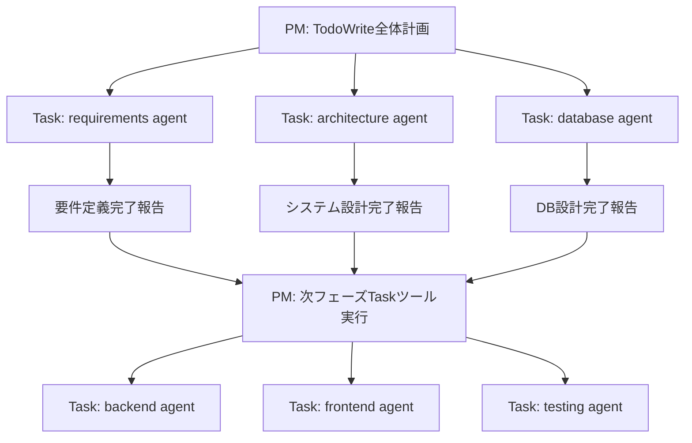
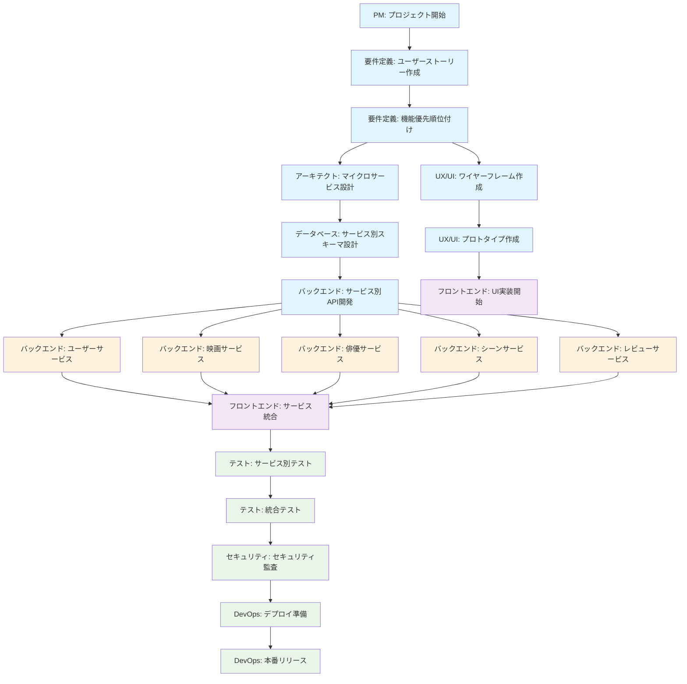
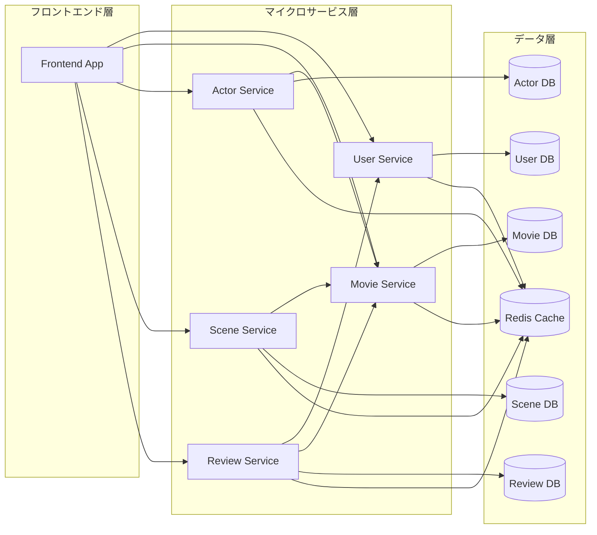

# プロジェクト憲章

## 映像作品・俳優データベースサービス

### プロジェクト概要

**プロジェクト名**: Cinecom
**開発期間**: 3ヶ月（MVP版）
**開発方式**: 複数AIエージェント協調開発
**アーキテクチャ**: マイクロサービス構成

### プロジェクトの目的

**主目的**: 映画・TV番組とそれに出演する俳優・スタッフの包括的なデータベースサービスを構築し、ユーザーが作品と人物、特定のシーン（戦闘、ロマンス、アクション等）を効率的に検索・発見できるWebアプリケーションを提供する

**成功指標**:

- **手動入力による100件以上の映像作品データ登録**
- **50件以上の映像作品にシーン情報付与（平均5シーン/作品）**
- 主要機能（検索・詳細表示・ユーザー評価・シーン検索）の実装完了
- レスポンス時間 < 500ms
- ユーザビリティテスト合格

### プロジェクトスコープ

#### **含まれるもの（In Scope）**

- 映像作品の基本情報管理（タイトル、配給日、ジャンル、あらすじ等）
- 俳優の人物情報管理
- 作品と人物の関連付け（キャスト情報）
- シーン管理機能（戦闘シーン、ロマンスシーン、アクションシーン等の分類・記録）
- 基本検索・フィルタリング機能
- ウォッチリスト・評価機能
- レスポンシブWebUI

#### **含まれないもの（Out of Scope）**

- 監督・スタッフ情報管理
- 動画ストリーミング機能
- チケット購入・予約システム
- ソーシャルメディア連携
- 多言語対応（英語・日本語のみ）
- モバイルアプリ
- 外部映画データAPI連携（TMDB等）
- 画像配信サービス（Cloudinary等）

### マイクロサービス構成

#### **サービス分割**

```yaml
user-service:
  責任: ユーザー管理・認証・プロフィール
  技術: NestJS + TypeScript
  データベース: PostgreSQL (users, profiles, auth_tokens)

movie-service:
  責任: 映画・TV番組データ管理
  技術: NestJS + TypeScript
  データベース: PostgreSQL (movies, genres)

actor-service:
  責任: 俳優・人物データ管理・キャスト関係
  技術: NestJS + TypeScript
  データベース: PostgreSQL (actors, cast_relations, filmography)

scene-service:
  責任: シーンデータ管理・分類
  技術: NestJS + TypeScript
  データベース: PostgreSQL (scenes, scene_categories, scene_tags)

review-service:
  責任: レビュー・評価・ウォッチリスト
  技術: NestJS + TypeScript
  データベース: PostgreSQL (reviews, ratings, watchlists)

frontend-app:
  責任: ユーザーインターフェース
  技術: Next.js 14+ with TypeScript
  API連携: 各マイクロサービスとの統合
```

### AIエージェント役割定義

#### **企画・設計系エージェント**

**要件定義エージェント**:

- **責任**: ユーザーストーリー作成、機能要件整理
- **成果物**: 要件定義書、ユーザーストーリー（docs/project/user_stories.md + GitHub Issues）
- **権限**: 機能優先順位の決定
- **KPI**: ユーザーストーリー完成度、要件変更回数
- **ユーザーストーリー管理方針**:
  - **新規作成**: user_stories.mdに追加 + 対応するGitHub Issue作成
  - **更新**: user_stories.mdを修正 + 未実装の場合は既存Issue更新、実装済みの場合は新Issue作成
  - **進捗管理**: GitHub Issuesをカンバンで視覚化して進捗追跡
- **スラッシュコマンド**:
- `/create_user_stories` - ユーザーストーリー作成（ファイル + Issues）
- `/update_user_stories` - ユーザーストーリー更新（ファイル + Issues管理）
- `/prioritize_features` - 機能優先順位付け
- `/trigger_architecture_design` - アーキテクトエージェントへマイクロサービス設計指示
- `/trigger_design_phase` - UX/UIエージェントへ設計フェーズ開始指示

**UX/UIデザインエージェント**:

- **責任**: ユーザー体験設計、インターフェース設計
- **成果物**: ワイヤーフレーム、デザインシステム、プロトタイプ
- **権限**: UI/UX仕様の最終決定
- **承認プロセス**:
  - **Level 1**: デザイン詳細（色彩、フォント、コンポーネント仕様）→ 自律判断
  - **Level 2**: UI/UX仕様変更（ナビゲーション、画面遷移）→ 要件定義エージェント + プロジェクトマネージャー承認
  - **Level 3**: 根本的UX変更（ユーザーフロー大幅変更）→ 全体合意 + 人間承認
- **KPI**: デザイン一貫性スコア、ユーザビリティテスト結果
- **スラッシュコマンド**:
- `/design_wireframes` - ワイヤーフレーム作成開始
- `/create_prototype` - プロトタイプ作成
- `/validate_ux` - UX検証
- `/request_design_approval` - 設計承認依頼（Level 2以上）
- `/trigger_frontend_design` - フロントエンドエージェントへUI実装指示

**アーキテクトエージェント**:

- **責任**: システム全体設計、技術選定、マイクロサービス設計
- **成果物**: システム構成図、技術仕様書、サービス間API仕様
- **権限**: 技術スタック・アーキテクチャの決定
- **承認プロセス**:
  - **Level 1**: 技術選定詳細（フレームワークバージョン、ツール選定）→ 自律判断
  - **Level 2**: API仕様変更、データベーススキーマ変更 → 関連エージェント協議
  - **Level 3**: 技術スタック変更、アーキテクチャ根本変更 → 全体合意 + 人間承認
- **KPI**: システム設計品質、技術選定適合性
- **スラッシュコマンド**:
- `/design_architecture` - アーキテクチャ設計開始
- `/design_microservices` - マイクロサービス分割設計
- `/select_tech_stack` - 技術スタック選定
- `/review_system_design` - システム設計レビュー
- `/trigger_database_design` - データベースエージェントへDB設計指示
- `/trigger_backend_setup` - バックエンドエージェントへ基盤構築指示

#### **開発系エージェント**

**フロントエンドエージェント**:

- **責任**: Next.js with TypeScriptベースのUI実装、フロントエンドパフォーマンス最適化
- **成果物**: Webアプリケーション（クライアントサイド）、ページパフォーマンス分析レポート
- **権限**: フロントエンド実装方法・UI最適化の決定
- **依存**: UX/UIデザインエージェント、バックエンドエージェント
- **協調**: DevOpsエージェント（システム全体パフォーマンス分析）
- **KPI**: ページロード時間、コードカバレッジ、ESLint準拠率
- **スラッシュコマンド**:
- `/implement_ui` - UI実装開始
- `/optimize_frontend` - フロントエンド最適化
- `/test_components` - コンポーネントテスト
- `/integrate_with_microservices` - マイクロサービスAPI統合開始
- `/trigger_frontend_testing` - テストエージェントへフロントエンドテスト指示

**バックエンドエージェント**:

- **責任**: NestJS with TypeScript + Express.jsベースのマイクロサービス実装、ビジネスロジック、APIパフォーマンス最適化
- **成果物**: マイクロサービス群、認証システム、API応答速度分析レポート
- **権限**: API実装仕様・バックエンド最適化の決定
- **依存**: アーキテクトエージェント、データベースエージェント
- **協調**: DevOpsエージェント（システム全体パフォーマンス分析）
- **KPI**: API応答時間、エラー率、コードカバレッジ
- **スラッシュコマンド**:
- `/implement_user_service` - ユーザーサービス実装
- `/implement_movie_service` - 映画サービス実装
- `/implement_actor_service` - 俳優サービス実装
- `/implement_scene_service` - シーンサービス実装
- `/implement_review_service` - レビューサービス実装
- `/setup_service_auth` - サービス間認証構築
- `/optimize_backend` - バックエンド最適化
- `/trigger_backend_testing` - テストエージェントへバックエンドテスト指示
- `/notify_frontend_ready` - フロントエンドエージェントへAPI準備完了通知

**データベースエージェント**:

- **責任**: データモデル設計、パフォーマンス最適化、データベース固有の性能分析
- **成果物**: PostgreSQLデータベーススキーマ、TypeORMエンティティ、マイグレーション、クエリ最適化レポート
- **権限**: データベース構造・クエリパフォーマンス改善の決定
- **依存**: アーキテクトエージェント
- **協調**: DevOpsエージェント（システム全体パフォーマンス分析）
- **KPI**: クエリ実行時間、データ整合性、インデックス効率
- **スラッシュコマンド**:
- `/design_user_schema` - ユーザーDBスキーマ設計
- `/design_movie_schema` - 映画DBスキーマ設計
- `/design_actor_schema` - 俳優DBスキーマ設計
- `/design_scene_schema` - シーンDBスキーマ設計
- `/design_review_schema` - レビューDBスキーマ設計
- `/optimize_queries` - クエリ最適化
- `/create_migrations` - マイグレーション作成
- `/setup_database` - データベース環境構築
- `/trigger_backend_development` - バックエンドエージェントへDB準備完了通知

#### **品質保証系エージェント**

**テストエージェント**:

- **責任**: テストケース作成・実行、品質担保、マイクロサービス統合テスト
- **成果物**: テストスイート、テストレポート、統合テスト結果
- **権限**: テスト合格基準の設定
- **KPI**: テストカバレッジ、バグ検出率、テスト実行時間
- **スラッシュコマンド**:
- `/create_unit_tests` - 単体テストスイート作成
- `/create_integration_tests` - 統合テストスイート作成
- `/run_service_tests` - サービス別テスト実行
- `/run_e2e_tests` - E2Eテスト実行
- `/analyze_coverage` - カバレッジ分析
- `/trigger_security_testing` - セキュリティエージェントへセキュリティテスト指示

**セキュリティエージェント**:

- **責任**: セキュリティ監査、脆弱性検査、マイクロサービス間通信セキュリティ
- **成果物**: セキュリティチェックリスト、監査レポート
- **権限**: セキュリティ要件の設定
- **KPI**: 脆弱性スコア、セキュリティテスト合格率
- **スラッシュコマンド**:
- `/security_audit` - セキュリティ監査実行
- `/scan_vulnerabilities` - 脆弱性スキャン
- `/validate_service_auth` - サービス間認証検証
- `/validate_api_security` - API セキュリティ検証
- `/trigger_deployment_prep` - DevOpsエージェントへデプロイ準備指示

#### **運用系エージェント**

**DevOpsエージェント**:

- **責任**: CI/CD構築、インフラ管理、GitHub環境設定、Claude Code協調システム運用、システムパフォーマンス分析・監視、マイクロサービスデプロイ管理
- **成果物**: デプロイパイプライン（Vercel + Render）、インフラコード、GitHub設定（CODEOWNERS、Webhooks、Actions）、Claude Code協調環境、Sentry統合、パフォーマンス分析レポート
- **権限**: デプロイ方法・インフラ構成・Claude Code協調環境・パフォーマンス改善施策の決定
- **KPI**: デプロイ成功率、システム稼働率、エージェント応答時間
- **スラッシュコマンド**:
- `/setup_ci_cd` - CI/CDパイプライン構築
- `/setup_microservice_deployment` - マイクロサービスデプロイ設定
- `/monitor_system` - システム監視
- `/manage_agents` - エージェント管理
- `/analyze_performance` - パフォーマンス分析
- `/trigger_staging_deployment` - ステージングデプロイ実行
- `/trigger_production_deployment` - 本番デプロイ実行

**プロジェクトマネージャーエージェント**:

- **責任**: 全体進捗管理、課題調整、合意形成プロセス運用、設計承認、リリース管理
- **成果物**: 進捗レポート、課題管理表、承認記録、リリース計画
- **権限**: スケジュール調整、優先順位変更、Level 1-2の承認、UX/UI設計承認、リリース承認
- **依存**: DevOpsエージェント（GitHub設定・運用）
- **KPI**: 進捗達成率、課題解決時間、エージェント稼働率、承認処理時間
- **スラッシュコマンド**:
- `/trigger_user_stories` - 要件定義エージェントへユーザーストーリー作成指示
- `/track_progress` - 進捗追跡
- `/manage_issues` - 課題管理
- `/coordinate_team` - チーム調整
- `/approve_design` - UX/UI設計承認
- `/approve_release` - リリース承認
- `/create_product_tag` - プロダクトタグ作成
- `/escalate_to_human` - 人間への承認エスカレーション
- `/trigger_next_phase` - 次フェーズ開始指示
- `/orchestrate_workflow` - ワークフロー全体統制

### 技術スタック

#### **フロントエンド**

- **フレームワーク**: Next.js 14+ with TypeScript
- **状態管理**: Zustand / Redux Toolkit
- **スタイリング**: Tailwind CSS + HeadlessUI
- **ビルドツール**: Next.js内蔵
- **テスト**: Jest + React Testing Library

#### **バックエンド（マイクロサービス）**

- **ランタイム**: Node.js 18+
- **フレームワーク**: NestJS with TypeScript + Express.js
- **認証**: JWT + OAuth2 (Google/GitHub)
- **API**: RESTful + GraphQL (Apollo Server)
- **バリデーション**: class-validator (RESTful) / zod (その他)
- **サービス間通信**: HTTP/REST + イベント駆動（Redis Pub/Sub）

#### **データベース**

- **メイン**: PostgreSQL 15+ (サービス別DB)
- **キャッシュ**: Redis 7+
- **ORM**: TypeORM
- **検索**: Elasticsearch (オプション)

#### **インフラ・運用**

- **コンテナ**: Docker + Docker Compose
- **CI/CD**: GitHub Actions
- **監視・ログ**: Sentry
- **デプロイ**: Vercel (Frontend) + Render (Backend Services)

#### **外部サービス**

- **通知**: Discord
- **分析**: Google Analytics

### Git戦略・デプロイフロー

#### **ブランチ戦略: GitHub Flow**

```yaml
ブランチ構成:
  main: 本番デプロイ対象ブランチ
  feature/*: 機能開発ブランチ
  hotfix/*: 緊急修正ブランチ

デプロイフロー:
  1. feature/* → PR → main (コードレビュー)
  2. main → ステージング環境 (自動デプロイ)
  3. 統合テスト → 受入テスト
  4. プロダクトタグ作成 (v1.x.x)
  5. 本番環境デプロイ (手動承認)
```

#### **環境別デプロイ戦略**

**開発環境 (Development)**:

```yaml
デプロイ対象: feature/*, hotfix/* ブランチ
トリガー: プッシュ時の自動デプロイ
目的: 各エージェントの個別機能確認
デプロイ方式: ブランチ別並行デプロイ

実装例:
- feature/user-auth → dev-user-auth.cinecom-dev.com
- feature/movie-search → dev-movie.cinecom-dev.com
- feature/scene-management → dev-scene.cinecom-dev.com
```

**ステージング環境 (Staging)**:

```yaml
デプロイ対象: main ブランチ
トリガー: mainブランチへのマージ時（サービス単位で継続的デプロイ）
目的: 受入テスト・QA検証・統合テスト
デプロイ方式: mainの最新状態を反映

実装例:
- user-service main → staging-user.cinecom.com
- movie-service main → staging-movie.cinecom.com
- scene-service main → staging-scene.cinecom.com
- frontend main → staging.cinecom.com
```

**本番環境 (Production)**:

```yaml
デプロイ対象: main ブランチ (プロダクトタグ v1.x.x)
トリガー: プロダクトリリースタグ作成時
目的: エンドユーザー提供
デプロイ方式: 統合バージョンでの一括デプロイ

実装例:
- プロダクトタグ v1.1.0 → 全サービスの特定コミット組み合わせ
- 各サービスバージョンの組み合わせを記録
- 本番環境への一括デプロイ
```

#### **マイクロサービス用CI/CD**

**サービス別ステージングデプロイ**:

```yaml
# GitHub Actions設定例
on:
  push:
    branches: [main]
    paths: 
      - 'services/user-service/**'
      - 'services/movie-service/**'
      - 'services/actor-service/**'
      - 'services/scene-service/**'
      - 'services/review-service/**'

jobs:
  detect-changes:
    # 変更されたサービスを検出
  deploy-changed-services:
    # 変更されたサービスのみステージング環境にデプロイ
```

**プロダクトタグベース本番デプロイ**:

```yaml
# リリースタグ作成時の動作
on:
  release:
    types: [published]

jobs:
  deploy-production:
    steps:
      - name: Create deployment manifest
        # 各サービスの現在のコミットハッシュを記録
      - name: Deploy all services
        # 全サービスを統合バージョンで本番デプロイ
      - name: Store deployment history
        # デプロイ履歴を保存
```

#### **バージョン管理戦略**

**プロダクトレベルのセマンティックバージョニング**:

```yaml
v1.0.0: 初回リリース
  - user-service: commit abc123
  - movie-service: commit def456
  - scene-service: commit ghi789
  - review-service: commit jkl012
  - frontend: commit mno345

v1.1.0: 機能追加 (シーン管理機能)
  - user-service: commit abc789 (認証強化)
  - movie-service: commit def890 (検索最適化)
  - actor-service: commit ghi456 (キャスト管理機能)
  - scene-service: commit jkl123 (新機能)
  - review-service: commit mno456 (UI改善)
  - frontend: commit pqr678 (新UI実装)

v1.1.1: バグ修正
  - user-service: commit abc789 (変更なし)
  - movie-service: commit def999 (検索バグ修正)
  - actor-service: commit ghi456 (変更なし)
  - scene-service: commit jkl123 (変更なし)
  - review-service: commit mno456 (変更なし)
  - frontend: commit pqr789 (UI修正)
```

### 意思決定プロセス

#### **決定権限レベル**

**Level 0 (人間の最終判断)**: プロジェクト方向性・ビジネス要件

- 機能要件の追加・削除
- プロジェクトスコープ変更
- ビジネス価値に関わる判断

**Level 1 (自律判断)**: 各エージェントの専門領域内

- 実装方法の詳細
- 専門分野でのベストプラクティス適用
- パフォーマンス最適化

**Level 2 (関連エージェント協議)**: 複数エージェントに影響

- API仕様変更
- データベーススキーマ変更
- UI/UX仕様変更
- マイクロサービス間インターフェース変更

**Level 3 (全体合意 + 人間承認)**: プロジェクト全体に影響

- 技術スタック変更
- アーキテクチャ根本変更
- スケジュール大幅変更
- マイクロサービス分割方針変更

#### **合意形成プロセス（Claude Code環境）**

1. **提案・通知**: 担当エージェントが変更案を作成し、以下の方法で通知
   - **GitHubプルリクエスト**: コード変更の場合
   - **GitHubイシュー**: 仕様変更・新機能提案の場合
   - **ドキュメント更新**: 設計書・仕様書の変更

2. **自動通知システム**:

   ```yaml
   通知トリガー:
     - PR作成時: 影響を受けるファイル・モジュールの担当エージェントに通知
     - Issue作成時: ラベルに基づいて関連エージェントに通知
     - ドキュメント更新: CODEOWNERS機能で担当者自動アサイン
   
   通知方法:
     - GitHub Webhookによる自動通知
     - Discord チャンネル通知
     - Claude Code Taskツールによるエージェント起動
     - GitHub Issues/PRベースでの協調
   ```

3. **ドキュメント更新確認システム**:

   ```bash
   # CODEOWNERS設定例
   /docs/architecture/     @architect-agent @backend-agent @frontend-agent
   /docs/api/  deploy-actor-service:
    needs: detect-changes
    if: needs.detect-changes.outputs.actor-service == 'true'
    runs-on: ubuntu-latest
    steps:
      - uses: actions/checkout@v4
      - name: Deploy actor-service to staging
        run: |
          cd services/actor-service
          docker build -t cinecom-actor-service:${{ github.sha }} .
          # Render.com or 他のサービスにデプロイ
             @backend-agent @frontend-agent
   /docs/database/        @database-agent @backend-agent
   /docs/design/          @ux-agent @frontend-agent
   
   # Discord通知設定
   channels:
     - "#cinecom-architecture": アーキテクチャ関連更新
     - "#cinecom-api": API仕様変更通知
     - "#cinecom-database": DB設計変更通知
     - "#cinecom-frontend": UI/UX設計変更通知
   ```

4. **影響度判定・レビュー依頼**:

   ```markdown
   # プルリクエスト・イシューテンプレート
   ## 変更概要
   - 変更内容の説明
   
   ## 影響を受けるサービス・エージェント（自動タグ付け）
   - [ ] @frontend-agent (UI変更の場合)
   - [ ] @backend-agent (API変更の場合)
   - [ ] @database-agent (スキーマ変更の場合)
   - [ ] user-service (ユーザー管理への影響)
   - [ ] movie-service (映画データへの影響)
   - [ ] scene-service (シーンデータへの影響)
   - [ ] review-service (レビューシステムへの影響)
   
   ## 影響度レベル
   - [ ] Level 1 (自律判断)
   - [ ] Level 2 (関連エージェント協議)
   - [ ] Level 3 (全体合意 + 人間承認)
   
   ## レビュー期限
   - 期限: [作成日 + 2営業日]
   ```

5. **レビュー・合意形成**:
   - 影響を受けるエージェントがGitHub上でレビュー・コメント
   - tmuxベースリアルタイム協議（必要時）
   - 合意形成後、承認プロセスへ

6. **決定・マージ**:
   - Level 0-3: 人間による最終承認後マージ
   - Level 1-2: プロジェクトマネージャーエージェントが承認後マージ

7. **全体通知**: マージ後、全エージェントに変更内容をDiscord・tmuxで通知

8. **レビュー依頼通知システム**: PRでレビュアーに指定されたエージェントへの自動通知

#### **レビュー依頼通知システム**

**GitHub Webhook → Discord → エージェント起動の自動フロー**:



**実装仕様**:

```bash
# webhook_handler.sh - GitHub Webhook処理
#!/bin/bash

PR_NUMBER=$(echo $WEBHOOK_DATA | jq -r '.number')
PR_TITLE=$(echo $WEBHOOK_DATA | jq -r '.pull_request.title')
PR_URL=$(echo $WEBHOOK_DATA | jq -r '.pull_request.html_url')
AUTHOR=$(echo $WEBHOOK_DATA | jq -r '.pull_request.user.login')
REVIEWERS=$(echo $WEBHOOK_DATA | jq -r '.pull_request.requested_reviewers[].login')

for reviewer in $REVIEWERS; do
    # Discord通知
    ./send_discord_notification.sh "$reviewer" \
        "🔍 **新しいレビュー依頼**
📄 PR #$PR_NUMBER: $PR_TITLE
👤 作成者: $AUTHOR  
🔗 $PR_URL
⏰ 期限: $(date -d '+24 hours' '+%Y-%m-%d %H:%M')" "high"
    
    # tmuxエージェント即座起動
    tmux send-keys -t "cinecom-project:$reviewer" "/check_messages" Enter
    
    # レビュー依頼記録
    echo "PR #$PR_NUMBER|$PR_TITLE|$PR_URL|$(date)|pending" >> \
        ".agents/reviews/$reviewer-assigned.csv"
done
```

**エージェント側レビュー確認システム**:

```bash
# /check_messages コマンド拡張
check_messages() {
    echo "=== 📬 メッセージ・レビュー依頼確認 ==="
    
    # 1. 新着レビュー依頼確認
    if [ -f ".agents/reviews/$(whoami)-assigned.csv" ]; then
        echo "📋 **新しいレビュー依頼:**"
        while IFS='|' read -r pr_num title url assigned_date status; do
            if [ "$status" = "pending" ]; then
                echo "  • PR #$pr_num: $title"
                echo "    URL: $url"
                echo "    依頼日時: $assigned_date"
                echo ""
            fi
        done < ".agents/reviews/$(whoami)-assigned.csv"
    fi
    
    # 2. GitHub API で最新のレビュー依頼確認
    echo "🔍 **GitHub 上の未処理レビュー:**"
    gh pr list --reviewer $(whoami) --state open --json number,title,url,createdAt
    
    # 3. 期限切れレビューの警告
    check_overdue_reviews
}

check_overdue_reviews() {
    current_time=$(date +%s)
    while IFS='|' read -r pr_num title url assigned_date status; do
        if [ "$status" = "pending" ]; then
            assigned_timestamp=$(date -d "$assigned_date" +%s)
            hours_passed=$(( (current_time - assigned_timestamp) / 3600 ))
            
            if [ $hours_passed -gt 24 ]; then
                echo "⚠️  **期限切れレビュー:** PR #$pr_num (${hours_passed}時間経過)"
                # 緊急Discord通知
                ./send_discord_notification.sh "$(whoami)" \
                    "🚨 レビュー期限切れ: PR #$pr_num" "critical"
            fi
        fi
    done < ".agents/reviews/$(whoami)-assigned.csv" 2>/dev/null || true
}
```

**Discord通知フォーマット標準化**:

```yaml
レビュー依頼通知フォーマット:
  タイトル: "🔍 新しいレビュー依頼"
  内容: |
    📄 PR #123: Add User Authentication API
    👤 作成者: @backend-agent
    📁 変更ファイル: docs/api/user_endpoints.md, src/auth/
    👥 レビュアー: @frontend-agent @security-agent
    🔗 https://github.com/cinecom/pull/123
    ⏰ 期限: 2025-08-22 18:00
  色: オレンジ (#ff9800)
  チャンネル: "#cinecom-reviews"

期限切れ警告フォーマット:
  タイトル: "🚨 レビュー期限切れ警告"
  内容: |
    📄 PR #123: Add User Authentication API
    ⏰ 経過時間: 26時間
    👤 担当者: @frontend-agent
    🔗 https://github.com/cinecom/pull/123
  色: 赤 (#f44336)
  チャンネル: "#cinecom-urgent"
```

**定期監視システム**:

```bash
# review_monitor.sh - 5分毎実行
#!/bin/bash

for agent in pm architect requirements ux-design frontend backend database testing security devops; do
    # エージェントが起動中かチェック
    if tmux list-sessions | grep -q "cinecom-project"; then
        if tmux list-windows -t cinecom-project | grep -q "$agent"; then
            # 定期的なレビュー確認を実行
            tmux send-keys -t "cinecom-project:$agent" "/check_messages >/dev/null 2>&1" Enter
        fi
    fi
done

# 全体的な期限切れレビューをPMに報告
overdue_count=$(find .agents/reviews/ -name "*-assigned.csv" -exec grep -l "pending" {} \; | wc -l)
if [ $overdue_count -gt 0 ]; then
    ./send_discord_notification.sh "pm" \
        "📊 期限切れレビュー: ${overdue_count}件" "high"
fi
```

**レビュー完了時の自動処理**:

```bash
# mark_review_completed.sh
#!/bin/bash

PR_NUMBER=$1
REVIEWER=$(whoami)

# レビュー完了マーク
sed -i "s/|$PR_NUMBER|.*|pending$/|$PR_NUMBER|.*|completed|$(date)/" \
    ".agents/reviews/$REVIEWER-assigned.csv"

# 完了通知
./send_discord_notification.sh "general" \
    "✅ レビュー完了: PR #$PR_NUMBER by @$REVIEWER" "medium"
```

**Claude Code特有の協調メカニズム**:

```bash
# .github/CODEOWNERS（例）
# API仕様変更
/api/                    @backend-agent @frontend-agent
/docs/api/               @backend-agent @frontend-agent

# マイクロサービス関連
/services/user-service/  @backend-agent @database-agent
/services/movie-service/ @backend-agent @database-agent
/services/actor-service/ @backend-agent @database-agent
/services/scene-service/ @backend-agent @database-agent
/services/review-service/ @backend-agent @database-agent

# データベース関連
/migrations/             @database-agent @backend-agent
/models/                 @database-agent @backend-agent

# フロントエンド
/frontend/               @frontend-agent @ux-agent
/docs/design/            @ux-agent @frontend-agent

# 設計ドキュメント
/docs/architecture/      @architect-agent @all-agents
/docs/project/charter.md @pm-agent @human-reviewer
```

#### **エージェント協調システム仕様**

**Claude Codeベース協調システム**:

```yaml
協調の基本構造:
  プロジェクトマネージャー:
    - TodoWriteツールで全体タスク管理
    - Taskツールで各エージェントに作業分散
    - 進捗追跡と課題調整

  専門エージェント:
    - specialized agentとしてTaskツールで起動
    - 各自の専門分野での作業実行
    - 作業完了時にPMに結果報告

  利用可能なsubagent_type:
    - general-purpose: 汎用的な研究・実装タスク
    - requirements: 要件定義・ユーザーストーリー作成
    - architecture: システム設計・技術選定
    - database: データベース設計・最適化
    - backend: マイクロサービス実装
    - frontend: UI/UX実装
    - testing: テスト作成・実行
    - security: セキュリティ監査
    - devops: CI/CD・デプロイ管理
```

**協調フロー**:



**Claude Code協調の特徴**:

```yaml
プロジェクトマネージャーの役割:
  - TodoWriteで全体進捗管理
  - 複数Taskツールの並列実行
  - エージェント間の調整
  
専門エージェントの役割:
  - 専門分野でのタスク実行
  - 完了報告をPMに返却
  - 必要に応じて他エージェントとの連携
  
協調の利点:
  - 複雑なメッセージングシステム不要
  - Claude Codeネイティブな並列処理
  - シンプルで可視化しやすい進捗管理
  - 自動的な依存関係解決

# コンテキスト：Cinecomプロジェクトの映像作品・俳優データベース開発
# 制約：プロジェクト憲章に従った品質基準・スコープ遵守
# 協調：Claude Code TodoWrite + Taskツールベースの協調システム
# レビュー：GitHub PRベースでの協調レビュー
```

**Claude Code協調の実装**:

```yaml
プロジェクトマネージャーの実装:
  # 全体タスク計画
  TodoWrite:
    - フェーズ別タスクリスト作成
    - 進捗追跡と状態管理
    - 課題・ブロッカーの可視化
  
  # 並列エージェント起動
  Task:
    - 複数の専門エージェントを並列起動
    - subagent_typeによる適切なエージェント選択
    - 詳細な作業指示とコンテキスト提供

専門エージェントの実装:
  # 各エージェントの責務
  - 専門分野での具体的な作業実行
  - 成果物の作成（ファイル、設計書、コード等）
  - 完了報告と次のフェーズへの引き継ぎ情報
  
協調メカニズム:
  - GitHub PRベースでのコードレビュー
  - ドキュメント更新での知識共有
  - Issuesでのタスクトラッキング
```

**Claude Code協調の実装例**:

```yaml
# プロジェクトマネージャーの実装例
PM実装パターン:
  1. 全体計画作成:
     TodoWrite([
       "Phase1: プロジェクト基盤構築",
       "要件定義・ユーザーストーリー作成", 
       "システム設計・アーキテクチャ決定",
       "データベーススキーマ設計"
     ])
  
  2. 並列エージェント起動:
     Task(subagent_type="general-purpose", 
          description="要件定義作成", 
          prompt="Cinecomプロジェクトのユーザーストーリーを作成...")
     
     Task(subagent_type="general-purpose",
          description="システム設計", 
          prompt="マイクロサービス構成を設計...")
  
  3. 進捗管理:
     TodoWrite(更新された進捗状況)

専門エージェントの実装:
  - 受け取ったタスクを専門分野で実行
  - 成果物をファイルとして作成
  - GitHub Issues/PRでの連携
  - 完了報告をPMに返却

協調メカニズム:
  - GitHub PRベースでのコードレビュー
  - ドキュメント更新での知識共有  
  - Issuesでのタスクトラッキング
  - Discord（オプション）での通知
```

### 開発フェーズ

#### **Phase 1: プロジェクト基盤構築（Week 1-2）**

**目標**: 開発環境とチーム協調システム確立

**Week 1**:

- [ ] GitHubリポジトリセットアップ（DevOps）
- [ ] Claude Code協調システム運用開始（DevOps）
- [ ] 要件定義・ユーザーストーリー作成（要件定義）
- [ ] マイクロサービスアーキテクチャ設計（アーキテクト）

**Week 2**:

- [ ] UI/UXワイヤーフレーム作成（UX/UI）
- [ ] サービス別データベーススキーマ設計（データベース）
- [ ] サービス間API仕様定義（バックエンド + アーキテクト）
- [ ] マイクロサービス用開発環境セットアップ（全エージェント）

**成果物**:

- プロジェクト基盤ドキュメント一式
- Claude Code協調システム運用環境
- マイクロサービス基盤構成
- サービス別開発環境

#### **Phase 2: コア機能実装（Week 3-8）**

**目標**: MVPの主要機能実装完了

**Week 3-4: 認証・基盤サービス**:

- [ ] ユーザーサービス実装（バックエンド + データベース）
- [ ] サービス間認証システム（バックエンド + セキュリティ）
- [ ] 基本的なUI コンポーネント（フロントエンド）
- [ ] マイクロサービス基盤構築（DevOps）

**Week 5-6: 映画・俳優・シーンデータサービス**:

- [ ] 映画サービス実装（バックエンド + データベース）
- [ ] 俳優サービス実装（バックエンド + データベース）
- [ ] シーンサービス実装（バックエンド + データベース）
- [ ] **シーン分類システム実装（戦闘、ロマンス、アクション等）**
- [ ] 映画・俳優・シーン検索UI（フロントエンド）
- [ ] **シーン管理・検索機能（フロントエンド + バックエンド）**
- [ ] サービス間連携テスト（テスト）

**Week 7-8: レビュー機能・統合**:

- [ ] レビューサービス実装（バックエンド + データベース）
- [ ] ウォッチリスト機能（フロントエンド + バックエンド）
- [ ] **シーンベース検索・推薦機能（「アクションシーンが多い映画」等）**
- [ ] マイクロサービス統合・最適化（全エージェント）
- [ ] 包括的テストスイート（テスト）
- [ ] セキュリティ監査（セキュリティ）

**成果物**:

- 動作するマイクロサービス群（5サービス + フロントエンド）
- **手動入力による100件以上の映画データ**
- **50件以上の作品にシーン分類データ（平均5シーン/作品）**
- サービス間統合テスト完了

#### **Phase 3: 品質向上・デプロイ（Week 9-12）**

**目標**: プロダクション準備とリリース

**Week 9-10: 品質向上**:

- [ ] 包括的テスト実装（テスト）
- [ ] マイクロサービスパフォーマンス最適化（DevOps + 各エージェント）
- [ ] セキュリティ強化（セキュリティ）
- [ ] UI/UX改善（UX/UI + フロントエンド）

**Week 11-12: デプロイ・運用準備**:

- [ ] プロダクション環境構築（DevOps）
- [ ] マイクロサービス用CI/CDパイプライン完成（DevOps）
- [ ] サービス監視・ログシステム（DevOps）
- [ ] ドキュメント整備（全エージェント）

**成果物**:

- プロダクション稼働可能なマイクロサービスアプリケーション（5サービス + フロントエンド）
- 運用ドキュメント
- プロジェクト完了レポート

### コミュニケーションルール

#### **Claude Code協調システム**

- **TodoWrite管理**: プロジェクトマネージャーによる全体進捗管理
- **並列Task実行**: 複数の専門エージェントによる並列作業
- **GitHub統合**: Issues/PRベースでの進捗追跡・レビュー
- **Discord統合**: リアルタイム通知・進捗共有（オプション）
- **定期レビュー**: フェーズ完了時の成果物レビュー
- **週次レビュー**: 日曜夜に全体進捗・課題分析

#### **通知システム設計原則**

**Claude Code協調システムでの監査証跡**:

```yaml
設計方針: GitHub + Claude Code + Discord（オプション）
目的: シンプルで追跡可能な協調システム

GitHub統合:
  役割: 成果物管理・レビュー・進捗追跡
  記録内容:
    - コード・ドキュメント変更履歴
    - Issues/PRでのタスク管理
    - レビューコメント・意思決定過程
    - CI/CDによる自動テスト結果

Claude Code TodoWrite:
  役割: 全体進捗管理・タスク分散
  記録内容:
    - フェーズ別タスク状況
    - 完了・進行中・ペンディング状態
    - エージェント間の依存関係
    - 課題・ブロッカーの可視化

Discord通知（オプション）:
  役割: リアルタイム通知・チーム状況共有
  記録内容:
    - 重要な進捗通知
    - 緊急事態・エスカレーション
    - フェーズ完了通知
```

#### **ドキュメント管理（Claude Code協調環境）**

- **Single Source of Truth**: GitHubリポジトリを情報集約先とする
- **バージョン管理**: 全ドキュメント・コードにGitバージョン管理
- **TaskWrite管理**: エージェント間でのタスク・進捗情報共有
- **GitHub統合**: Issues/PRによる作業追跡とレビュープロセス
- **協調レビュー**: エージェント間でのコードレビュー・承認プロセス
- **CODEOWNERS活用**: GitHubプルリクエスト時の自動レビュアーアサイン

#### **ログ・監査システム**

```bash
# 完全な監査証跡のためのログ構成
.agents/logs/
├── coordination.log          # エージェント間協調ログ
├── deployment.log           # デプロイメント履歴
├── performance.log          # パフォーマンス監視
├── communication/
│   ├── discord-history.json    # Discord通知履歴
│   ├── tmux-commands.log       # tmuxコマンド実行履歴
│   ├── file-operations.log    # ファイル操作履歴
│   └── review-timeline.json   # レビュープロセス詳細履歴
├── errors/
│   ├── agent-errors.log       # エージェントエラー履歴
│   ├── system-failures.log    # システム障害履歴
│   └── communication-failures.log # 通信障害履歴
└── audit/
    ├── decision-history.json  # 意思決定履歴
    ├── escalation-log.json   # エスカレーション履歴
    └── human-interventions.log # 人間介入履歴

# ログ分析・問題究明用コマンド
./analyze_logs.sh <start_date> <end_date> <incident_type>
./trace_communication.sh <pr_number> <agent_name>
./generate_audit_report.sh <date_range>
```

#### **課題・ブロッカー対応**

- **即座にエスカレーション**: 24時間以内に解決できない課題
- **影響度評価**: Critical/High/Medium/Lowで分類
- **代替案検討**: ブロッカー発生時は並行して代替案検討
- **自動リカバリ**: 可能な限り自動的な代替手段実行
- **Discord緊急通知**: 重要度Criticalの即座通知
- **レビュー期限管理**: 24時間以内のレビュー完了目標・期限切れ自動警告

### 品質基準

#### **コード品質**

- **テストカバレッジ**: 80%以上（サービス別）
- **静的解析**: ESLint/Prettier/SonarQube通過必須
- **コードレビュー**: 全PR必須レビュー・承認
- **ドキュメント**: 全API・コンポーネントの説明完備
- **マイクロサービス品質**: サービス間API契約テスト

#### **パフォーマンス**

- **API応答時間**: 95%パーセンタイルで500ms以下（サービス別）
- **ページロード時間**: First Contentful Paint 2秒以下
- **可用性**: 99.9%稼働率（サービス別）
- **同時接続**: 1000ユーザー対応
- **サービス間通信**: レイテンシ < 100ms

#### **セキュリティ**

- **OWASP Top 10**: 全項目対策実装
- **認証**: JWT + OAuth2実装
- **サービス間認証**: 適切な認証・認可実装
- **データ保護**: 個人情報暗号化
- **脆弱性スキャン**: 定期実行・パス必須

### リスク管理

#### **技術リスク**

- **サービス間依存**: API契約の早期確定・バージョニング戦略
- **パフォーマンス劣化**: 分散システム監視・最適化
- **データ整合性**: サービス間データ同期戦略
- **スケーラビリティ**: 個別サービススケーリング準備

#### **協調リスク**

- **エージェント間依存**: インターフェース仕様の早期確定
- **認識齟齬**: 定期的な仕様確認・ドキュメント更新
- **進捗差**: 定期モニタリング・早期調整
- **通信障害**: tmux環境の冗長化・復旧手順
- **Discord障害**: バックアップ通知システム

#### **人的リスク**

- **レビュー遅延**: 自動エスカレーション機能
- **仕様変更**: 変更管理プロセス厳格化
- **知識ギャップ**: エージェント間知識共有促進

### モニタリング・メトリクス

#### **開発進捗メトリクス**

- **スプリント達成率**: 目標80%以上
- **コミット頻度**: 1日平均2-3コミット/エージェント
- **PR処理時間**: 平均24時間以内
- **コードレビュー時間**: 平均4時間以内
- **サービス別デプロイ頻度**: 週2-3回以上

#### **品質メトリクス**

- **バグ発生率**: 週次10件以下（全サービス合計）
- **テスト実行時間**: 5分以内（サービス別）
- **ビルド成功率**: 95%以上
- **セキュリティスコア**: A評価以上
- **サービス間API成功率**: 99.5%以上

#### **協調システムメトリクス**

- **エージェント応答時間**: 平均30秒以内
- **メッセージ処理率**: 99%以上
- **協調エラー率**: 5%以下
- **夜間自動処理成功率**: 90%以上
- **Discord通知成功率**: 99%以上
- **レビュー期限内完了率**: 95%以上（24時間以内）
- **レビュー依頼通知成功率**: 99%以上

### 成功基準

#### **機能要件達成**

- [ ] 映画検索・詳細表示機能
- [ ] 俳優プロフィール・フィルモグラフィー表示
- [ ] **シーン管理機能（登録・編集・検索・フィルタリング）**
- [ ] **シーン分類システム（戦闘、ロマンス、アクション、コメディ等）**
- [ ] ユーザー登録・ウォッチリスト機能
- [ ] レスポンシブUI実装
- [ ] 評価・レビューシステム
- [ ] マイクロサービス間連携機能

#### **非機能要件達成**

- [ ] **手動入力による100件以上の映像作品データ登録**
- [ ] **50件以上の作品にシーン情報付与（戦闘、ロマンス、アクション等）**
- [ ] API応答時間500ms以下
- [ ] セキュリティ要件満足
- [ ] 99.9%稼働率達成
- [ ] マイクロサービス個別デプロイ可能

#### **協調開発成功**

- [ ] 全エージェントが定められた役割を完遂
- [ ] 重大な設計変更なく開発完了
- [ ] 品質基準をクリア
- [ ] エージェント協調システムの安定運用
- [ ] Discord連携システムの効果的運用

#### **ビジネス目標達成**

- [ ] ユーザビリティテスト合格
- [ ] パフォーマンステスト合格
- [ ] セキュリティ監査通過
- [ ] 運用保守ドキュメント完備
- [ ] マイクロサービス運用体制確立

### エージェント間ワークフロー自動化

#### **開発フロー全体図**



#### **マイクロサービス依存関係図**



### 緊急時対応プロトコル

#### **エージェント障害時**

```bash
# エージェント復旧手順
./scripts/recover_agent.sh <agent_name>

# 状態確認
./scripts/check_agent_health.sh

# 緊急時の人間へのエスカレーション
./scripts/emergency_notify.sh <issue_description>
# Discord緊急チャンネルへも自動通知
```

#### **協調システム障害時**

1. **自動復旧試行**: tmuxセッション再起動
2. **バックアップシステム起動**: 簡易メッセージシステム + Discord通知に切り替え
3. **人間通知**: 重要度Criticalで即座に報告
4. **代替手段**: 一時的にGitHub Issue/PRベースでの協調

#### **マイクロサービス障害時**

- **サービス分離**: 他サービスへの影響を最小化
- **自動フェイルオーバー**: ヘルスチェック → 自動復旧
- **緊急メンテナンスモード**: 該当サービスのみ停止
- **データ整合性確保**: サービス間データ同期の検証・修復

### ドキュメント管理体系

#### **必須ドキュメント**

```bash
docs/
├── project/
│   ├── charter.md (本憲章)
│   ├── requirements.md
│   ├── user_stories.md
│   └── project_plan.md
├── architecture/
│   ├── system_design.md
│   ├── microservices_design.md
│   ├── api_specification.md
│   ├── database_schema.md
│   └── security_design.md
├── development/
│   ├── setup_guide.md
│   ├── coding_standards.md
│   ├── git_workflow.md
│   ├── microservices_development.md
│   └── testing_strategy.md
├── operations/
│   ├── deployment_guide.md
│   ├── monitoring_setup.md
│   ├── backup_strategy.md
│   └── troubleshooting.md
└── agents/
    ├── coordination_manual.md
    ├── agent_responsibilities.md
    ├── communication_protocols.md
    ├── discord_integration.md
    └── emergency_procedures.md
```

#### **ドキュメント更新ルール**

- **即座更新**: API仕様、データベーススキーマ変更
- **毎日更新**: 進捗レポート、課題管理
- **週次更新**: アーキテクチャドキュメント、運用手順
- **フェーズ終了時**: 全体的なドキュメント見直し
- **Discord自動通知**: 重要ドキュメント更新時

#### **学習・改善メカニズム**

#### **エージェントパフォーマンス向上**

- **日次レビュー**: 各エージェントの作業効率・品質分析
- **週次改善**: ボトルネック特定・プロセス最適化
- **知識蓄積**: よくある課題・解決策のナレッジベース構築
- **ベストプラクティス共有**: 成功パターンの横展開
- **マイクロサービス固有学習**: サービス分割・連携のノウハウ蓄積
- **監査ログ分析**: 通信パターン・問題発生パターンの分析

#### **協調システム最適化**

- **通信パターン分析**: エージェント間の連携効率測定
- **自動化推進**: 繰り返し作業の自動化識別・実装
- **予測機能**: 過去データから課題・リスク予測
- **適応的調整**: プロジェクト進捗に応じた協調ルール調整
- **Discord統合最適化**: 通知効率・情報共有の改善
- **監査証跡活用**: 過去の意思決定・問題解決プロセスからの学習

#### **問題究明・改善プロセス**

```bash
# インシデント発生時の調査フロー
./investigate_incident.sh <incident_id> <start_time> <end_time>

# 調査対象ログ
1. Discord履歴: エージェント間の対話・意思決定過程
2. tmuxコマンドログ: 実際の処理実行履歴
3. ファイル操作ログ: システム状態変更の詳細
4. GitHub履歴: コード・ドキュメント変更との関連

# 改善提案生成
./generate_improvement_suggestions.sh <analysis_period>
# → 通信効率化、自動化機会、リスク軽減策を提案
```

### プロジェクト完了条件

#### **最終成果物チェックリスト**

**技術成果物**:

- [ ] 動作するマイクロサービスアプリケーション（フロントエンド + 5つのバックエンドサービス）
- [ ] サービス別データベース（100件以上の映画データ含む）
- [ ] マイクロサービス用CI/CDパイプライン
- [ ] サービス別テストスイート（80%以上カバレッジ）
- [ ] セキュリティ監査レポート
- [ ] パフォーマンステスト結果（サービス別）

**ドキュメント成果物**:

- [ ] ユーザーマニュアル
- [ ] 技術ドキュメント一式（マイクロサービス構成含む）
- [ ] 運用保守マニュアル（サービス別）
- [ ] プロジェクト完了レポート
- [ ] エージェント協調システム運用実績
- [ ] Discord連携システム運用実績

**品質確認**:

- [ ] 全機能テスト合格
- [ ] サービス間統合テスト合格
- [ ] パフォーマンス要件達成
- [ ] セキュリティ要件達成
- [ ] ユーザビリティテスト合格
- [ ] 運用稼働確認（マイクロサービス個別）

#### **プロジェクト終了プロセス**

1. **最終テスト実行**: 全エージェントによる包括テスト
2. **成果物レビュー**: 人間による最終確認
3. **知見整理**: プロジェクト全体の学習事項まとめ
4. **移行準備**: 運用チームへの引き継ぎ準備
5. **プロジェクト終了**: 正式なプロジェクト完了宣言

### 次期プロジェクトへの展開

#### **エージェント協調システムの再利用**

- **テンプレート化**: 今回のシステムを他プロジェクト用にテンプレート化
- **改善反映**: 今回の学習事項を次期システムに反映
- **スケール対応**: より大規模なプロジェクトでの協調システム設計
- **Discord統合ノウハウ**: 効果的な通知・協調パターンの横展開

#### **マイクロサービス開発ノウハウ**

- **サービス分割パターン**: 効果的なマイクロサービス分割方法
- **エージェント協調パターン**: 分散開発での効率的な協調方法
- **CI/CD最適化**: マイクロサービス用デプロイパイプライン

#### **知識・経験の蓄積**

- **ベストプラクティス集**: 各エージェントの効果的な作業パターン
- **課題・解決策DB**: 発生した問題と解決方法のデータベース
- **協調パターン**: 効果的なエージェント間協調パターンの体系化
- **Discord活用法**: プロジェクト管理・チーム協調でのDiscord活用ノウハウ

---

**承認**: 全エージェントがこの憲章に同意することで、協調開発を開始します。

**バージョン**: 2.0
**作成日**: 2025年8月21日
**更新日**: 2025年8月21日 (マイクロサービス構成・Discord連携・Git戦略追加)
**次回レビュー**: フェーズ1完了時（Week 2終了時）

**主要更新内容**:

- マイクロサービス構成の追加
- Discord通知システムの統合
- GitHub Flow + 環境別デプロイ戦略
- プロダクトレベルのバージョニング戦略
- サービス別CI/CD設計
- CODEOWNERS活用によるレビュープロセス

**憲章承認者**:

- [ ] 人間（プロジェクトオーナー）
- [ ] プロジェクトマネージャーエージェント
- [ ] アーキテクトエージェント
- [ ] DevOpsエージェント
- [ ] その他全エージェント

**重要事項**:

- 本憲章は生きた文書として、プロジェクト進行中に必要に応じて更新される
- 重要な変更は全エージェントの合意と人間の承認が必要
- Claude Code協調システムの効率的運用が本プロジェクトの成功の鍵
- マイクロサービス構成による分散開発の効率性が重要な成功要因

**開始条件**:

1. GitHubリポジトリのセットアップ完了（マイクロサービス構成対応）
2. Claude Code協調環境の確認完了
3. Discord連携システムの設定完了（オプション）
4. CODEOWNERS設定完了
5. TodoWrite + Taskツールの動作確認完了
6. 人間による最終承認

**連絡先**:

- プロジェクトオーナー: [設定要]
- 緊急時エスカレーション: [設定要]
- Discord: #cinecom-urgent (緊急), #cinecom-general (一般)
- 技術サポート: DevOpsエージェント経由

---

**バージョン**: 1.0
**作成日**: 2025年8月21日
**次回レビュー**: フェーズ1完了時（Week 2終了時）
